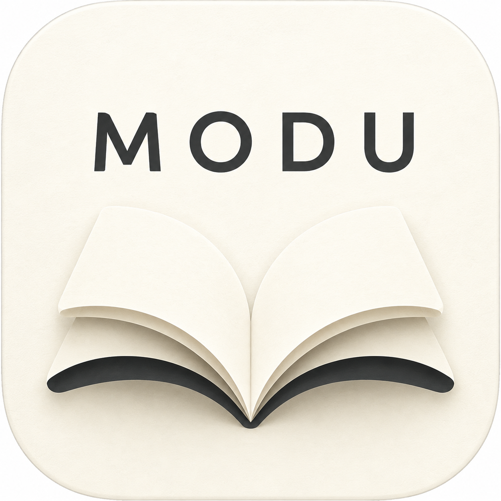

# 默读 · Modu Reader

<p align="center"></p>

**本项目来源于 [Anx Reader](https://github.com/anxcye/anx-reader) 和 [ReadAny（Reader Any）](https://github.com/codedogQBY/ReadAny)。感谢两个项目的原作者和贡献者。**
This is an independently modified derivative, not an official release of either upstream.

默读是基于 Flutter 的开源阅读器：书架、电子书阅读、笔记、阅读统计、WebDAV 同步，以及 AI 阅读技能、翻译、TTS 和混合 RAG。
项目处于 **Beta** 阶段：编译成功不等于所有平台功能均已实机验收。

## 下载

[GitHub Releases](https://github.com/sobranie2406/modureader/releases) · [构建状态](https://github.com/sobranie2406/modureader/actions) · [问题反馈](https://github.com/sobranie2406/modureader/issues)

| 平台 | 目标架构 | 分发形式与限制 |
| --- | --- | --- |
| Windows | x64、ARM64 | 便携 ZIP；未做商业代码签名，需要 WebView2 Runtime |
| Linux | x64、ARM64 | tar.gz；Debian 13 (trixie) 构建，需 GTK/WPE WebKit 等系统库 |
| Android | x86_64、arm64-v8a | 项目专用密钥签名的 APK；首次安装请核验下载来源 |
| macOS | x64、ARM64 | ZIP；未公证，非 App Store 版本 |
| iOS | ARM64 真机 | iOS 16+，**unsigned.ipa**；无 Apple 分发签名，不能直接安装，需要自行合法签名 |

这里的 x64 指 x86-64，ARM64 也是 64 位。iPhone/iPad 没有 x64 真机包。
表格是构建目标，**只有 Release 中实际存在并通过校验的附件才是已生成产物**。
不提供绕过操作系统安全机制的脚本。签名、依赖和安装说明见 [发布说明](docs/RELEASING.md)。

## 功能与已知限制

- EPUB / PDF 等书籍导入、阅读、标注、笔记与阅读统计。
- 书籍菜单的后台向量化 / 重新向量化队列；远程嵌入与四个可下载的 ONNX 本地模型。
- AI 阅读技能、可编辑提示词、按模型设置温度 / Token / 上下文轮数。
- 多服务商 AI、翻译、Edge / 兼容接口 TTS。
- API Key 同步默认关闭，单独开启并使用独立密码加密；普通同步开关不自动包含密钥。
- 密码 PDF 暂不支持；纯扫描 PDF 不做 OCR；语音、远程 AI 和翻译需要相应网络/服务。
- 目前真实界面回归主要在 macOS，其他平台首次构建仍需设备验证，详见 [测试范围](docs/TESTING.md)。

## 从源码构建

固定 Flutter 版本记录在 [.github/flutter-version](.github/flutter-version)，依赖锁定在 pubspec.lock。
需要对应平台的 Flutter 原生工具链；本地 tokenizer 的源码编译还需要 Rust（移动端需相应 Rust target）。

```sh
flutter pub get
flutter gen-l10n
dart run build_runner build --delete-conflicting-outputs
flutter test --concurrency 1
# 在对应宿主平台运行：
flutter build macos --release
# Android 的 release 签名先按 docs/RELEASING.md 配置
flutter build apk --release --target-platform android-arm64,android-x64 --split-per-abi
```

完整可复现的构建/打包步骤以 [.github/workflows/build.yaml](.github/workflows/build.yaml) 和 scripts/release 为准。
Dart 包名暂时保留 anx_reader，以兼容现有 import；用户可见品牌及应用 ID 为 Modu / com.modu.reader。

## 开源许可与来源

整体按 **GPL-3.0-or-later** 发布，见 [LICENSE](LICENSE)。
Anx Reader 的 MIT 版权与许可保留在 [LICENSES/Anx-Reader-MIT.txt](LICENSES/Anx-Reader-MIT.txt)；
ReadAny 的版权与许可保留在 [LICENSES/ReadAny-GPL-3.0-or-later.txt](LICENSES/ReadAny-GPL-3.0-or-later.txt)。
固定上游提交、修改范围和第三方归属见 [UPSTREAM.md](UPSTREAM.md)、[NOTICE](NOTICE)。
分发二进制时请保留许可、注明修改，并提供对应版本的完整源码与构建脚本。

[隐私说明](PRIVACY.md) · [安全报告](SECURITY.md) · [参与贡献](CONTRIBUTING.md)
