<p align="center">
  
</p>
<h1 align="center">Modu Reader</h1>
<p align="center">
  <a href="README_zh.md">简体中文</a> · <a href="README.md">English</a>
</p>
<p align="center">An open-source, cross-platform reader for ebooks, PDFs and scanned books. Crop and enhance original pages, recognize text with on-device OCR, read with full-text translation, listen aloud and explore your books with AI. Keep notes and reading progress together with WebDAV sync.</p>

<p align="center">
  <a href="https://github.com/sobranie2406/modureader/releases/latest"></a>
  <a href="LICENSE"></a>
  <a href="#downloads"></a>
</p>
<p align="center">
  <a href="https://github.com/sobranie2406/modureader/releases/latest"><b>Download</b></a> ·
  <a href="https://gitee.com/sobranie2406/modureader/releases">Gitee mirror</a> ·
  <a href="#features">Features</a> ·
  <a href="docs/SETTINGS.md">Settings guide</a> ·
  <a href="docs/README.md">Documentation</a> ·
  <a href="https://t.me/Modureader">Telegram channel</a> ·
  <a href="https://t.me/ModuReaderDiscussion">Telegram group</a> ·
  <a href="https://github.com/sobranie2406/modureader/issues">Feedback</a>
</p>

## Community and feedback

Connect with the Modu Reader community on Telegram:

| Community | What you will find | Address |
| --- | --- | --- |
| **Modu Reader · Telegram channel** | New releases, changelogs and project updates | [https://t.me/Modureader](https://t.me/Modureader) |
| **Modu Reader · Telegram discussion group** | Reading discussions, help using the app, bug reports and feature suggestions | [https://t.me/ModuReaderDiscussion](https://t.me/ModuReaderDiscussion) |

Join the **Modu Reader QQ group: 1009765685** (Chinese-language discussion). Search for the group number in QQ to request to join.

Please submit bugs and feature requests through [GitHub Issues](https://github.com/sobranie2406/modureader/issues/new/choose). If you cannot use GitHub, use the [feedback form](https://docs.qq.com/smartsheet/form/dxaiuhjrhCar%2Ft00i2h%2FvI8Bvs?tab=t00i2h). Describe one issue or idea per report and include the Modu version, OS and device, reproduction steps and expected behavior. Do not share keys, passwords, private books or unredacted logs.

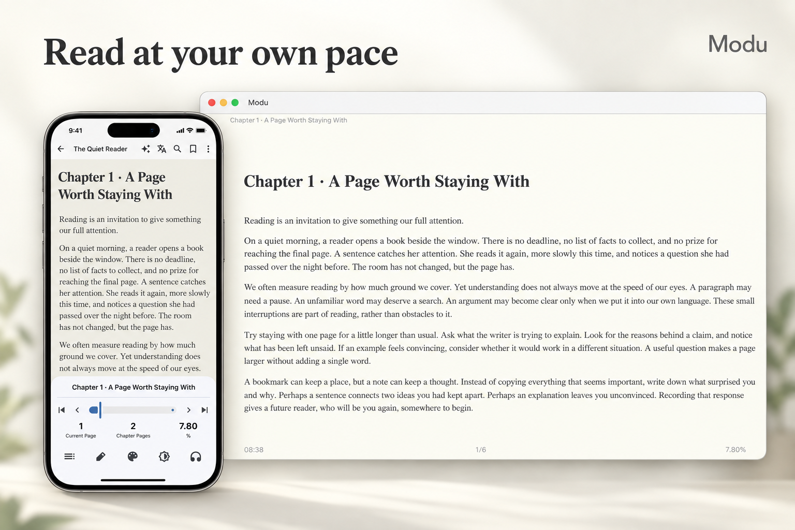

> **Local reading does not require an AI account.** AI, online translation and online speech are optional; availability and costs depend on your chosen providers. See [Releases](https://github.com/sobranie2406/modureader/releases) for version updates and usage notes.

Modu has no in-app unlock purchases or subscriptions. Fees charged by online service providers are separate from Modu.

<a id="downloads"></a>

## Downloads

| Platform | Published architectures | Installation                                                                                                                                |
| -------- | ----------------------- | ------------------------------------------------------------------------------------------------------------------------------------------- |
| Windows  | x64, ARM64              | EXE installer with shortcuts and an uninstaller; no commercial code signature; requires WebView2 Runtime                                    |
| Linux    | x64, ARM64              | DEB for Debian 13 (trixie); install with APT to resolve system dependencies                                                                 |
| Android  | arm64-v8a              | APK signed with the project's dedicated key; verify the download source before installing                                                   |
| macOS    | x64, ARM64              | DMG; drag the app to Applications; unnotarized, not an App Store release                                                                    |
| iOS      | ARM64 devices           | iOS 16+; IPA has no Apple distribution signature and cannot be installed directly; you must sign it yourself using a valid signing identity |

<details>
<summary>Installation, updates and release notes</summary>

**Latest release: 1.2.1** — Improved WebDAV sync and Jianguoyun request handling, PDF/scanned-page performance and whitening, context-aware selection AI, and QQ community access.

Modu checks for updates at launch. Settings → About Modu → App updates uses one GitHub/Gitee source selector for both checking and downloading, defaulting to GitHub. After switching sources, check again before downloading. Failed GitHub requests fall back to Gitee while size and SHA-256 verification remain mandatory. macOS downloads open in your browser. Gitee hosts packages, documentation and update metadata; old releases are replaced by the newest release, with links to the corresponding GitHub source.

Settings → Appearance lets you choose an app language or follow the system. Bundled AI prompts follow that language; your edited prompts retain their original text.

Here, x64 means x86-64; ARM64 is also 64-bit. There is no x64 iPhone/iPad device package.
Download the installer and its SHA-256 file from [Releases](https://github.com/sobranie2406/modureader/releases), choosing your system and architecture.

Desktop apps use native installers. Download the installer for your platform, not GitHub's automatically generated source archive. Licenses are included in each package. See [Release and installation instructions](docs/RELEASING.md).

</details>

<a id="features"></a>

## Features

A library for your books, a workspace for your thoughts, and tools you can make your own.

| Module | What you can do |
| --- | --- |
| [Library](#library) | Import seven ebook formats, organize folders, pin books and browse a remote library |
| [Reading & styles](#reading) | Tune typography, switch layouts and apply visual CSS presets |
| [PDF & scanned books](#scanned-books) | Crop margins, set panel order and enhance original pages |
| [On-device OCR](#ocr) | Download lightweight models, reflow recognized text and extract passages for AI |
| [Custom CSS](#css) | Visual rules, custom code, multiple profiles and visible effects on the page |
| [Listening](#listening) | Choose a voice, edit narration prompts and listen at up to 4× speed |
| [AI reading](#ai) | Ask about chapters, customize skills and continue conversations |
| [Selection tools](#selection) | Toggle and reorder actions; create your own AI commands |
| [Full-text translation & search](#translation) | Read inline translations, switch display modes and search selected text |
| [Offline dictionaries](#dictionary) | Import your dictionaries and see definitions beside the selected word |
| [Notes & highlights](#notes) | Capture passages, add comments and export notes with links back to the book |
| [Reading statistics](#statistics) | Review reading time, trends and per-book progress |
| [Vector indexing](#vector) | Build local book indexes for semantic search and retrieval-augmented answers |
| [Sync & database backup](#data) | Sync through WebDAV and export or restore library backups |
| [Global settings backup](#backup) | Transfer preferences by file or link, with credentials controlled separately |

Screens use original demo content rather than a personal library. Try [The Quiet Reader](docs/examples/modu-reading-demo-en.epub). Detailed options and entry points are in the [settings guide](docs/SETTINGS.md).

<a id="scanned-books"></a>

## Original pages, easier to read

Keep the original layout of a PDF or scanned image book while making the page fit your screen. Dedicated reading controls replace text-book typography settings only for PDFs and books classified as scans.

- **Crop the margins:** automatic cropping detects content bounds on each page; adjust the safety margin or drag a crop rectangle manually.
- **Read in the right order:** split a page into panels, set their order, rotate the page and choose single-page or continuous-scroll reading.
- **See the details:** fit the page to the screen or its width, zoom in, and enhance stroke strength, contrast, darkening, paper whitening or sharpness.
- **Compare with the original:** preview changes and optionally fade scanned watermarks. Crop and enhancement settings do not rewrite the source book.

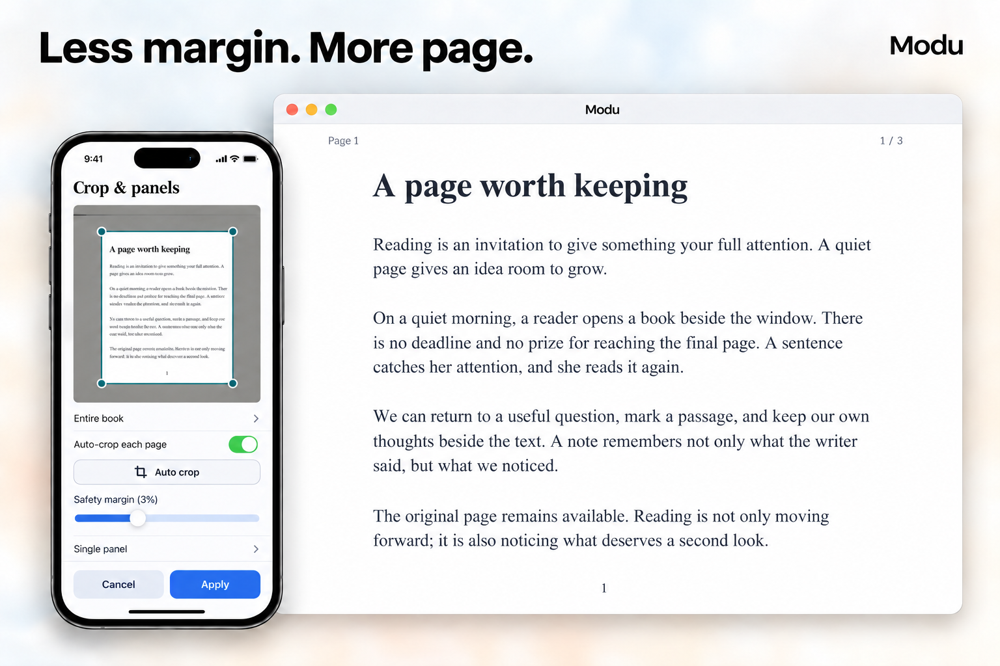

EPUB, MOBI, AZW3 and FB2 image books are identified during import, not every time you open them. You can also change the classification in the bookshelf menu. Ordinary text books retain their familiar controls.

<details>
<summary>Image processing and e-ink controls</summary>

Automatic crop settings can apply throughout the book, with bounds detected separately for each page. Keep a little margin to protect footnotes and page numbers. Scanned watermark fading is image processing, not guaranteed reconstruction of text hidden beneath a watermark; always compare the result with the original.

The menu follows the app theme. E-ink-only refresh controls appear when E-INK mode is enabled; hardware refresh support depends on the device. Ordinary text ebooks retain their normal reading menus and styles.

</details>

<a id="ocr"></a>

## Turn scans into readable text

Go beyond an image of the page. Recognize text locally, then read the result **inside the reader**, with adjustable typography, selection tools, highlights, notes and AI actions.

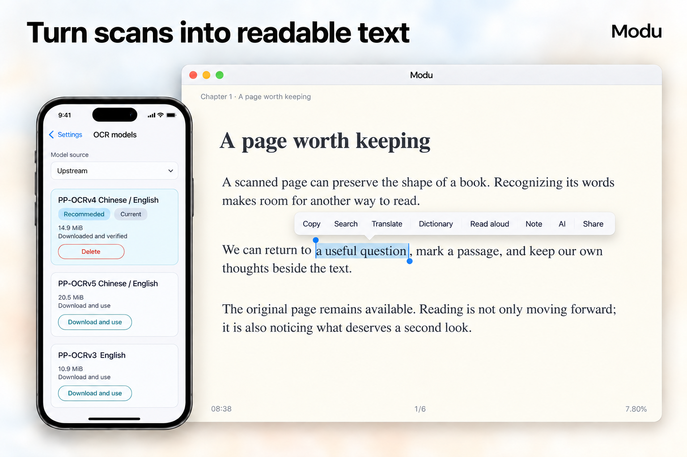

1. In **Settings → OCR models**, choose a model and download source. **PP-OCRv4 Chinese / English** is the recommended starting point.
2. Open the PDF/scanned-book menu. **Text reflow** uses an available text layer; **OCR reflow** recognizes the current page image. Reflow uses the current page or its cropped area, without an extra region-selection step.
3. Select words in the reflowed text to copy, translate, annotate or ask AI. The style gear adjusts the recognized text, not the original scan or other books.
4. For a specific passage, choose **Extract**, select a region and send its text to an **editable AI draft**. Review it before sending.

<details>
<summary>Lightweight models, offline use and limitations</summary>

| Model | Download size | Use |
| --- | --- | --- |
| PP-OCRv4 Chinese / English | About 14.9 MiB | Recommended general choice |
| PP-OCRv5 Chinese / English | About 20.5 MiB | Newer mobile model |
| PP-OCRv3 Chinese / English | About 12.5 MiB | Smaller alternative |
| PP-OCRv3 English | About 10.9 MiB | Lightweight English recognition |

Models are downloaded on demand, not bundled in the installer. Choose the upstream host or Gitee mirror; downloads are checked by size and SHA-256. Delete a downloaded model from its card to reclaim space without deleting books or recognized text.

OCR runs on the device after download and needs no API key. Sending extracted text to an online AI provider is a separate action. Recognition quality depends on scan clarity, language and layout; check names, numbers and complex columns against the original. OCR does not automatically index the entire book or rewrite the source PDF.

</details>

<a id="library"></a>

## Your library, your way

Bring EPUB, PDF, MOBI, AZW3, FB2, TXT and Markdown books into one library. Search by title, filter by reading status, group books into folders, or pin the ones you want to keep close.

- Select multiple books to create a folder or move them into an existing one.
- Browse a separate WebDAV library, search and sort files, then download books for offline reading.
- Import an ANX Reader ZIP backup through the migration entry in Advanced settings.

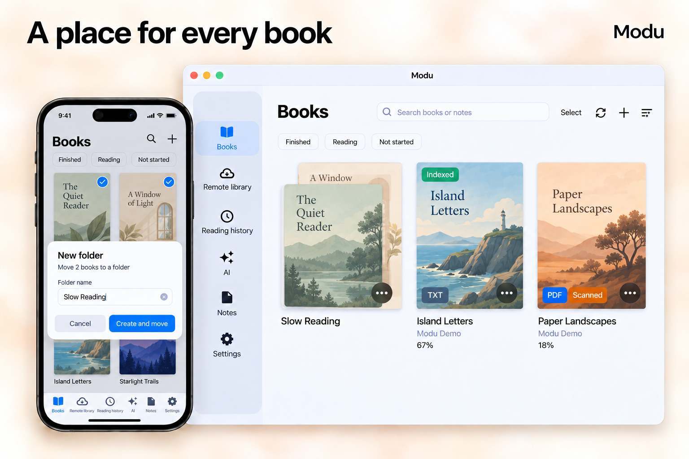

<details>
<summary>Remote library and migration details</summary>

The remote-library connection is separate from synchronization: it reads and downloads files without uploading or deleting server content. Configure it in Settings → Remote library settings. Anonymous and username/password access are supported; prefer HTTPS and a read-only account. Downloads are one at a time, with a 512 MiB per-file limit and duplicate checks.

ANX backup import validates and merges supported records while retaining existing Modu data and creating a pre-import database snapshot. Read the import screen's compatibility notes before proceeding.

</details>

<a id="reading"></a>

## Make every page your own

Adjust fonts, font thickness, line spacing, paragraph spacing and margins. Use separate body and Latin fonts, choose paginated or scrolling reading, and make the page comfortable for your screen.

- Tap the page for chapter/page navigation; drag the progress slider to preview chapter titles.
- Choose themes and backgrounds, or use dark, OLED and e-ink modes.
- Manage named CSS profiles with editable presets, visual controls, regex highlights and optional custom code. Enable several profiles together or import/export them.

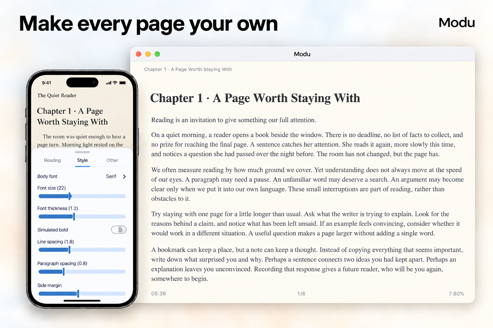

<details>
<summary>Typography, navigation and CSS details</summary>

Settings → CSS settings provides 32 named profiles and 13 editable presets. Detailed editing stays in Settings; the reader applies your profiles. See [CSS presets](docs/CSS_PRESETS.md).

Font thickness ranges from 0.5 to 2.0 in 0.1 steps. The optional Simulated bold control can add weight to fixed-weight fonts above 1.0; it cannot make a fixed bold face thinner. PDF and other fixed-layout pages are not re-typeset.

Scrolling page steps can be set from 80% to 100%. Long-press selection can expand to a word or paragraph, then be adjusted with the selection handles. Footnotes open within the reader. Vertical typesetting supports optional frames and column rules for suitable books.

Choose an app language or follow the system in Settings → Appearance. Bundled AI prompts follow that language; your edited prompts keep their original text.

</details>

<a id="css"></a>

## Your CSS rules, visible on the page

Start with visual presets for colors, spacing and underlines, then add custom CSS when you want finer control. The example below shows **colored dialogue with wavy underlines, highlighted keywords and generous paragraph spacing**.

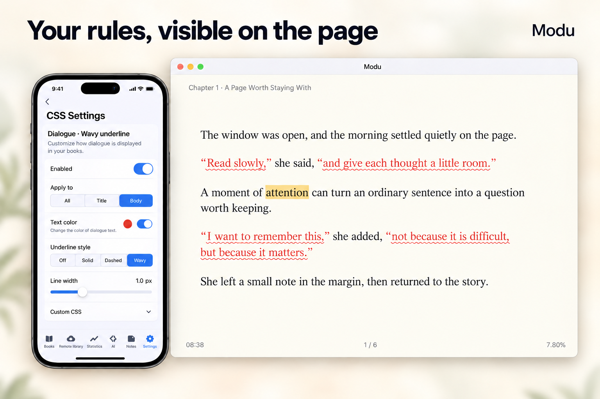

- 32 named slots and 13 editable presets, with independent switches and combined activation.
- Visual controls for page typography and layout; regex rules for dialogue and keywords.
- Edit centrally in Settings and apply from the reader, with per-book activation choices.
- Import a plain CSS file or a Modu JSON profile; export the current or all nonempty profiles.

<details>
<summary>Presets, scope and file exchange</summary>

Presets cover novels, vertical spacing, images, centered headings, long-form text, English paragraphs, poetry, tables, dialogue colors/wavy lines, keyword/date highlights and heading underlines. Choose all text, headings or body scope; set your own keyword in the rule.

Page CSS controls layout. Regex highlights style matching text with colors, backgrounds and underlines without changing the book text or annotation positions. JSON preserves visual parameters, expressions and scope. Import only trusted CSS: remote resource URLs may make network requests. See [CSS profiles](docs/CSS_PRESETS.md).

</details>

<a id="listening"></a>

## A voice for every story

Listen with system speech, Edge TTS, Xiaomi MiMo, OpenAI-compatible services or DashScope. Start from the current position or selected text, and keep listening across chapters.

**Start with a template, then make the voice your own.** Choose natural narration, bedtime reading, fiction performance, knowledge explanation, classical recitation or news reading. Edit the description and append suggestions for articulation, pauses, tone and pace.

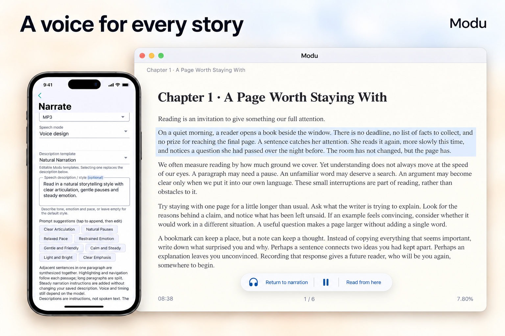

- MiMo offers preset voices and voice design through descriptions of timbre, tone and delivery.
- OpenAI-compatible speech settings offer an instructions switch, templates and an editable prompt.
- A compact reader toolbar provides play/pause, return to the narration position and read from here.
- Online narration supports up to 4× playback, with separate 3× and 4× slider steps after 2×.

<details>
<summary>Voice prompts and playback details</summary>

Find these controls in Settings → Narrate. Selecting a description template fills the editor; suggestions append text for further editing. For example:

> Read in a natural storytelling style with clear articulation, moderate pauses between sentences, and steady emotion, suitable for long listening sessions.

Descriptions guide delivery; they are not spoken book text or additional official voice IDs. MiMo's rate slider adjusts local playback speed from 0.5–4.0× without regenerating audio. Prompt support depends on the service; instructions are not sent to tts-1 / tts-1-hd and can be disabled for incompatible endpoints.

Edge, MiMo, OpenAI-compatible and DashScope synthesis groups neighboring sentences within natural paragraphs, splitting long paragraphs. Highlighting and previous/next controls follow each passage; system speech retains sentence navigation. Upcoming passages are prefetched during playback.

</details>

<a id="ai"></a>

## Turn reading into a conversation

Ask about a passage, summarize a chapter, examine an argument or organize ideas into a mind map. Configure your own AI provider and choose which reading tools it may use.

- Built-in and custom reading skills can be enabled, disabled, edited and reordered together.
- Turn on “fill the input first” to add a chapter range or extra instructions before sending.
- Continue with follow-up questions in the current conversation or a restored historical conversation.
- View mind maps full screen, zoom and pan, collapse branches, and export them.

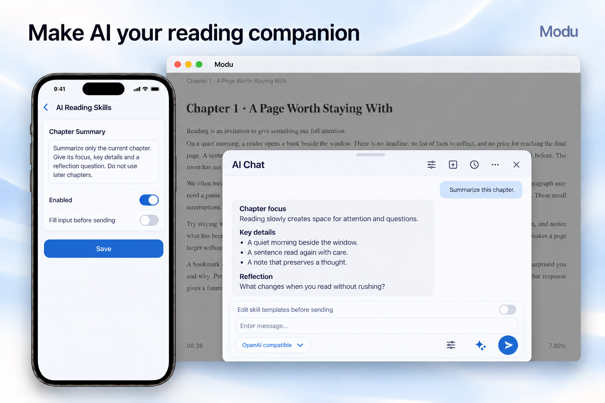

<details>
<summary>Models, skills and conversation context</summary>

Supported protocols include OpenAI-compatible, Claude and Gemini. Configure endpoints, keys and model parameters in Settings → AI settings. Service capabilities and charges depend on the provider.

Home AI works with library, notes and reading records. Reader AI works with the current book, chapter or selection. Enabled tools can retrieve chapters, search text and inspect notes; answers depend on the material actually retrieved.

Common skills include chapter/book summaries, concept explanations, argument analysis, character tracking, quote collection, reading guides and mind maps. Mind maps export as PNG, SVG, Markdown, FreeMind (.mm) or JSON. Completed reader answers return to their first paragraph.

</details>

<a id="selection"></a>

## Put your favorite tools at your fingertips

Choose what appears when you select text. Keep useful actions close and hide the ones you do not need.

- Toggle and drag-sort built-in tools, annotation controls and custom AI commands.
- Edit command names, icons and prompts; common AI templates start disabled.
- Choose selected text only or selected text with context, and opt into online search per command.
- Selection templates are managed separately from reading skills but use the same reader AI dialog.

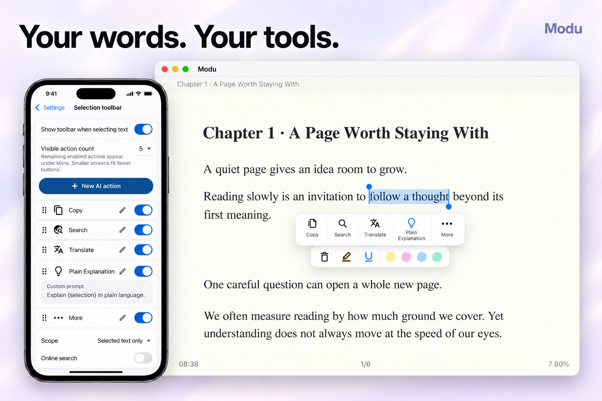

AI Knowledge uses your current model's knowledge first. If further checking is needed, use **Online search** beneath the answer, before Regenerate and Copy, to retrieve Wiktionary, Wikipedia and Baidu Baike material in the same conversation. The same model summarizes the results with sources. No separate search API key is needed.

<a id="translation"></a>

## Read beyond one language

Read translated paragraphs **directly on the book page**, rather than in a separate selection popup. Choose **Original + translation** for inline bilingual reading, or **Translation only** for a continuous translated view.

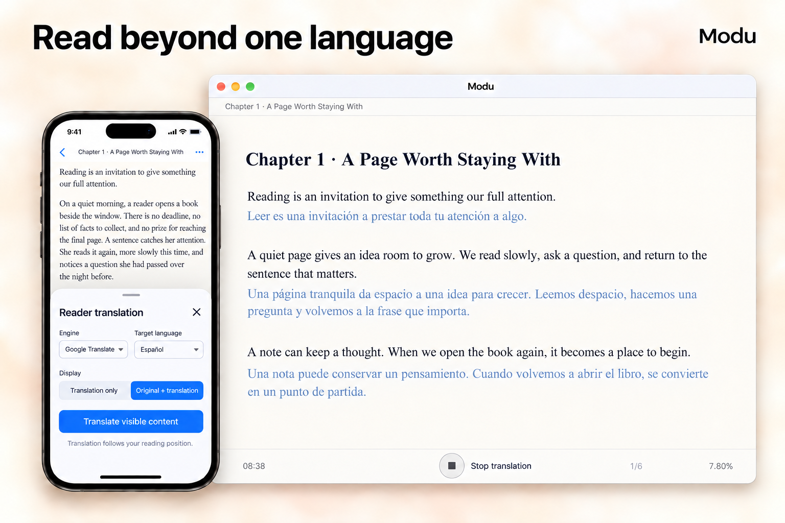

Open the reader's translation controls, choose an engine and target language, then translate the current reading content. Translation follows the reading position; this is not a one-click export of a translated copy of the entire book. The stop action stays in the toolbar rather than covering the text.

- Google translation, AI translation and DeepL/DeepLX.
- Selection translation also offers embedded webpages, including Baidu and Youdao; these are separate from inline full-text translation.
- Selection search with Baidu, Bing, Google, Baidu Baike, Wikipedia or a custom engine in the built-in browser.

The English showcase uses English–Spanish paragraphs; the [Chinese showcase](README_zh.md#translation) uses English–Chinese paragraphs and a Chinese interface. Online translation sends the requested text to the selected provider.

<a id="dictionary"></a>

## Understand a word without losing your place

Select a word and read its definition right beside the book. Imported MDX and StarDict dictionaries work offline, with no AI account required.

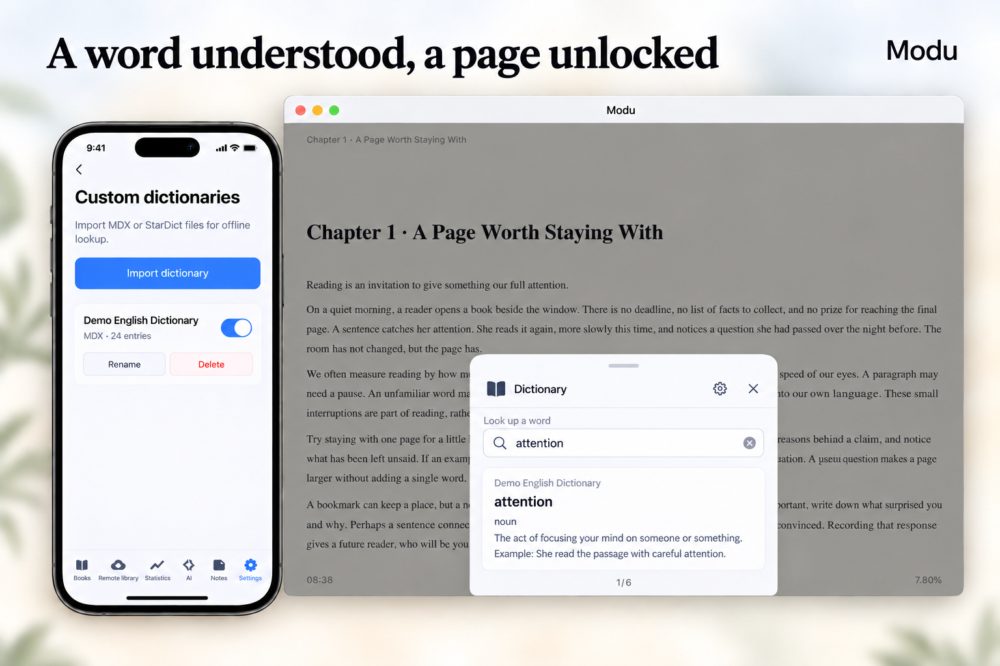

Name, enable, disable or remove dictionaries in Settings → Custom dictionaries. Results come from your imported dictionary's entries; dictionary files are not bundled. The picture uses an original demonstration entry.

<a id="notes"></a>

## Keep what stays with you

Highlight a passage, underline an idea and add your own thoughts. Review notes by book and chapter, then return to the original passage when you need its context.

- Choose highlight colors and annotation styles.
- On mobile, use Quick mark to swipe over text and save a highlight.
- Export Markdown, TXT or CSV with original passages and creation or last-edit times.
- Reading-position links in exports reopen the corresponding book location in Modu when that book is available.

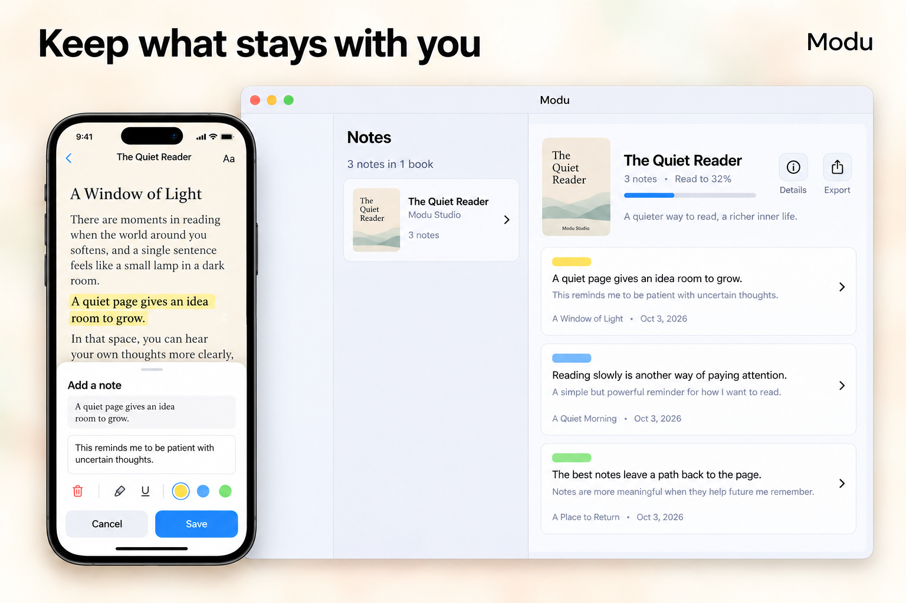

<details>
<summary>Deleting annotations and exporting notes</summary>

Select part or all of an existing highlight or underline, choose the trash action and confirm to delete the complete overlapping annotation and its comment. The confirmation appears above the toolbar and color palette.

Exports distinguish the original passage from your comments; Markdown also highlights the note content. Quick mark works with reflowable text, not scanned PDF images, and has an explicit Exit control to restore normal gestures.

</details>

<a id="statistics"></a>

## See your reading take shape

Follow reading time, reading days, streaks and progress through individual books. Switch between periods to see how your habits change.

- Review time trends and the reading heatmap.
- Explore per-book reading records.
- Rearrange dashboard cards and keep the metrics you care about.

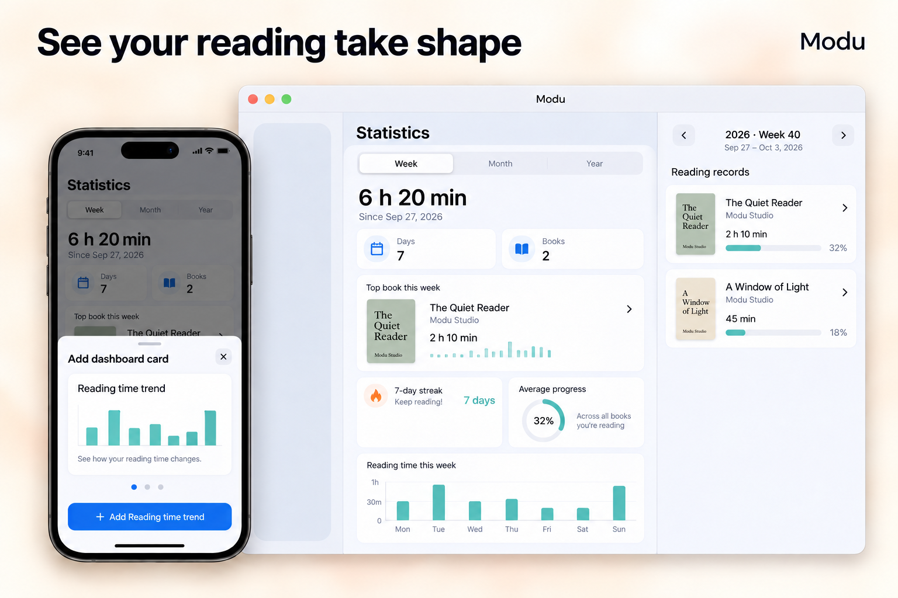

<a id="vector"></a>

## Find ideas, not just words

Vector indexing turns book passages into searchable representations of their meaning. Combine keyword and semantic search to find relevant text, then let AI use retrieved passages as context for its answer.

1. Choose a local ONNX model or a remote embedding API in Settings → Embedding Models.
2. Download a local model when needed, then index a book from its menu.
3. Follow the background indexing task; use the resulting index for retrieval.

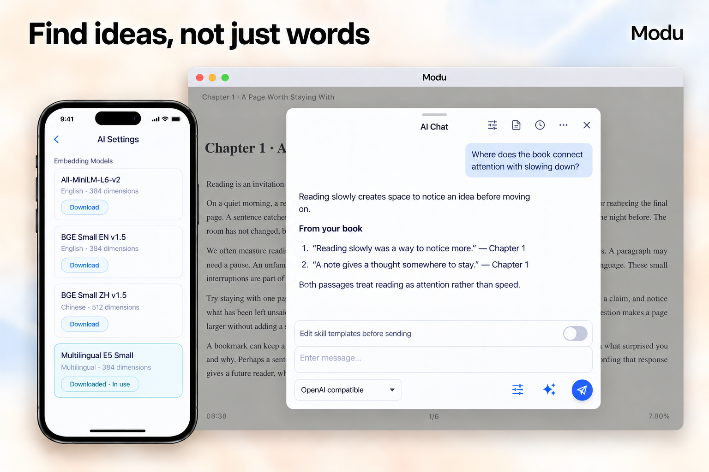

<details>
<summary>Local models, downloads and privacy</summary>

| Local model | Languages | Dimensions |
| --- | --- | --- |
| all-MiniLM-L6-v2 | English | 384 |
| BGE Small EN v1.5 | English | 384 |
| BGE Small ZH v1.5 | Chinese | 512 |
| Multilingual E5 Small | Multilingual | 384 |

Models and tokenizers are downloaded on demand, not bundled in installers. Choose Hugging Face or the [Gitee model mirror](https://gitee.com/sobranie2406/modu-models/releases/tag/models-v1); downloads are checked by size and SHA-256. Verified local models can run offline without an API key.

Automatic indexing after import is off by default. Indexes stay local and are not included in WebDAV library sync. Reindex when changing the embedding model. **The chat model and embedding model are separate settings:** one generates answers; the other helps retrieve relevant passages.

Local embedding computation stays on the device. Remote embedding services receive the text to be indexed; online AI services receive the context used for their answers.

</details>

<a id="data"></a>

## Continue on another device

Use your own WebDAV server to sync books, notes, bookmarks and reading progress. Keep a database backup before changing devices or restoring a library.

- Automatic sync, Wi-Fi-only controls and optional timed sync during foreground reading.
- ZIP database backup export/import with a visible save location.
- Backup includes local books, covers, notes, reading records, AI chat history and general settings.
- Sensitive service settings are excluded by default; backup export can optionally include them with encryption.

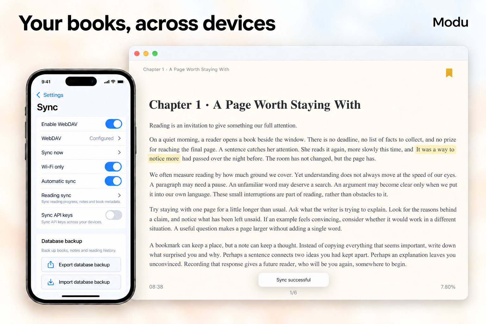

<details>
<summary>Restore behavior and sync security</summary>

Settings → Sync → Database backup exports Modu-Backup-*.zip. Select the ZIP directly when restoring; do not extract it. Import validates then **replaces existing data rather than merging**, so back up the current library first and restart after restoring.

Windows saves to the user's Downloads folder; other platforms use the system save destination. Successful export shows the path or filename. Download any books you want included before backing up.

WebDAV sync merges records by stable identity and uses the latest reading action, not the furthest progress. Fonts, background images, local dictionaries and vector indexes are not part of library sync. Server compatibility is described in the [sync guide](docs/WEBDAV_RECORD_SYNC.md).

Sync API keys is a separate opt-in switch. Sensitive configurations are encrypted with AES-256-GCM and require the same encryption password on every device. This does not encrypt the entire library or replace a trusted server.

</details>

<a id="backup"></a>

## Take your preferences with you

Global settings backup transfers the way you use Modu: appearance, reader layout, CSS profiles, AI skills, selection tools, speech, translation and general preferences.

- Export a settings file or modu link; restore from a file or pasted link.
- Review the contents before importing.
- Keep accounts, passwords and API configurations behind an independent switch, **off by default**.
- Only changes to built-in prompt templates are backed up, alongside your custom templates.

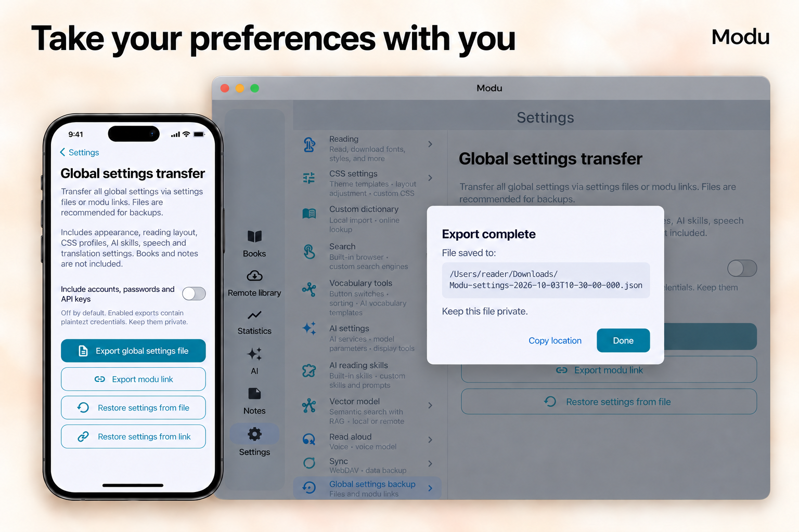

| Need | Use |
| --- | --- |
| Move preferences and custom prompts | Global settings backup |
| Back up books, notes and reading records | Database backup |
| Keep reading data aligned across devices | WebDAV sync |

Settings files do **not** contain books, notes, chat history, font/background files, dictionaries or downloaded vector models. If you include credentials, the settings file or link contains recoverable plaintext credentials: **keep it private**. QR export is not offered; use a file for a complete settings backup.

Windows settings exports default to Downloads; other platforms use the selected save destination. The success message shows the saved location and lets you copy it.

## Getting started

1. Download the package for your system and architecture from [Releases](https://github.com/sobranie2406/modureader/releases). Follow the installation instructions.
2. Add an ebook to the library and open it. No API key is required if you do not use AI.
3. To use AI, configure a model in Settings → AI Settings and test the connection.
4. For semantic search, download a local model in Settings → Embedding Models (Chinese BGE is the default), then index a downloaded book from its menu. You can also configure a remote embedding endpoint.
5. Choose translation, read-aloud and sync services as needed. See the [Settings guide](docs/SETTINGS.md) for instructions, parameter explanations and security considerations.

## Feedback

See [Releases](https://github.com/sobranie2406/modureader/releases) for version changes and downloads.

When reporting an issue in [this repository](https://github.com/sobranie2406/modureader/issues), include your version, system, architecture, reproduction steps and a sample without private information. Never submit API keys, WebDAV passwords or settings files and links containing credentials.

If Modu helps you enjoy reading, please give the repository a **Star ⭐** in the top-right corner. It helps more readers discover the project and encourages continued development. Thank you!

## Build from source

<details>
<summary>Expand build instructions</summary>

The pinned Flutter version is recorded in [.github/flutter-version](.github/flutter-version); dependencies are locked in pubspec.lock. You need Flutter's native toolchain for your platform. Building the tokenizer from source also requires Rust, including the appropriate mobile targets.

```sh
flutter pub get
flutter gen-l10n
dart run build_runner build --delete-conflicting-outputs
flutter test --concurrency 1
# Run on the appropriate host platform:
flutter build macos --release --build-name "$(python3 scripts/release/verify_mobile.py --apple-build-name)"
# Configure Android release signing as described in docs/RELEASING.md first.
flutter build apk --release --target-platform android-arm64 --split-per-abi
```

See [.github/workflows/build.yaml](.github/workflows/build.yaml) and scripts/release for the complete build and packaging procedure. The Dart package name remains `anx_reader` for compatibility with existing imports. The user-facing brand and application ID are Modu / `com.modu.reader`.

</details>

## Star history

Thank you to everyone supporting Modu. Click the chart to explore its growth on [Star History](https://www.star-history.com/?repos=sobranie2406%2Fmodureader\&type=date\&legend=top-left).

<a href="https://www.star-history.com/?repos=sobranie2406%2Fmodureader&amp;type=date&amp;legend=top-left">
  <picture>
    <source media="(prefers-color-scheme: dark)" srcset="https://api.star-history.com/chart?repos=sobranie2406%2Fmodureader&amp;type=date&amp;theme=dark&amp;legend=top-left" />
    <source media="(prefers-color-scheme: light)" srcset="https://api.star-history.com/chart?repos=sobranie2406%2Fmodureader&amp;type=date&amp;legend=top-left" />
    
  </picture>
</a>

## License and origins

The project is distributed under **GPL-3.0-or-later**; see [LICENSE](LICENSE).
Anx Reader's MIT copyright and license are preserved in [LICENSES/Anx-Reader-MIT.txt](LICENSES/Anx-Reader-MIT.txt).
ReadAny's copyright and license are preserved in [LICENSES/ReadAny-GPL-3.0-or-later.txt](LICENSES/ReadAny-GPL-3.0-or-later.txt).
See [UPSTREAM.md](UPSTREAM.md) and [NOTICE](NOTICE) for pinned upstream revisions, modification scope and third-party attribution. When distributing binaries, retain the licenses, identify your modifications and provide the complete corresponding source and build scripts for that version.

[Privacy](PRIVACY.md) · [Security](SECURITY.md) · [Contributing](CONTRIBUTING.md)
