# 默读 · Modu Reader

[简体中文](README.md) | [English](README_EN.md)

本项目仅维护以上中文、英文两份首页说明。

<p align="center"></p>

默读是基于 Flutter 的开源 AI 阅读器。把电子书、笔记、阅读进度与 AI 问答放在一起：先读书，再围绕当前章节提问；需要语义检索时，为书籍建立本地或远程向量索引。

**最新版本：1.1.11** — 修复自动选词反复锁定范围，扩展后直接显示拖动手柄；修复 AI 回答末尾丢失及历史回答空白；阅读 AI 支持当前与历史对话内连续追问。

**本地阅读不需要 AI 账号。** AI、在线翻译和在线语音按需配置，费用与可用性取决于所选服务。各版本更新与使用说明见 [Releases](https://github.com/sobranie2406/modureader/releases)。

默读不提供内购解锁或订阅；在线服务商自行收取的费用不属于默读内购。

如果默读对你有帮助，欢迎点击仓库右上角的 **Star ⭐**，让更多人发现它，也为持续改进添一份支持。谢谢！

[功能介绍与实拍截图](#功能一览) · [开始使用](#开始使用) · [设置指南](docs/SETTINGS.md) · [下载](#下载)

## 下载

[GitHub Releases](https://github.com/sobranie2406/modureader/releases) · [Gitee 安装包镜像](https://gitee.com/sobranie2406/modureader/releases) · [构建状态](https://github.com/sobranie2406/modureader/actions) · [问题反馈](https://github.com/sobranie2406/modureader/issues)

应用每次启动检查更新，也可在「设置 → 关于默读 → 版本检查与更新」选择 GitHub 或 Gitee，检查、下载、取消并打开安装器。默认优先 GitHub，连接失败时自动尝试 Gitee；手动选择 Gitee 则直接使用镜像。两站提供相同安装包及 SHA-256，应用内下载安装前再次校验。macOS 使用浏览器下载 DMG。Gitee 保留最新版，GitHub 提供历史版本及完整源码。

检查与下载共用一个来源选择，切换来源后重新检查即可。语言可在「设置 → 外观」手动选择或跟随系统，内置 AI 提示词随应用语言切换；用户自行编辑的提示词保持原文。

| 平台 | 已发布架构 | 安装方式 |
| --- | --- | --- |
| Windows | x64、ARM64 | EXE 安装器；支持快捷方式和卸载，未做商业代码签名，需要 WebView2 Runtime |
| Linux | x64、ARM64 | DEB；面向 Debian 13 (trixie)，使用 APT 安装并解析系统依赖 |
| Android | x86_64、arm64-v8a | 项目专用密钥签名的 APK；首次安装请核验下载来源 |
| macOS | x64、ARM64 | DMG；打开后拖入 Applications，未公证，非 App Store 版本 |
| iOS | ARM64 真机 | iOS 16+，IPA；无 Apple 分发签名，不能直接安装，需要自行合法签名 |

这里的 x64 指 x86-64，ARM64 也是 64 位。iPhone/iPad 没有 x64 真机包。
安装包及 SHA-256 校验文件见 [Releases](https://github.com/sobranie2406/modureader/releases)，请按系统与架构选择。

桌面端提供原生安装包，GitHub 的 `Source code (zip)` 用于获取源码。签名、依赖和安装步骤见 [安装指南](docs/RELEASING.md)。

## 功能一览

当前版本提供以下阅读、AI 与书库管理功能。

| 模块 | 可以做什么 | 从哪里进入 |
| --- | --- | --- |
| 书架与导入 | 导入 EPUB、PDF、MOBI、AZW3、FB2、TXT、Markdown（MD）；书籍/文件夹置顶，批量建文件夹与移入，筛选、搜索及管理标签 | 首页「书架」，添加、选择按钮或书籍菜单 |
| 远程书库 | 独立连接 WebDAV，浏览文件夹；按名称、添加/修改时间、大小升降序排列，搜索及格式筛选，下载导入书架 | 首页「远程书库」；设置 → 远程书库设置 |
| 阅读与排版 | 目录跳转、相邻章节预加载、分页/滚动；关闭书籍脚本时横排流式书籍支持跨章连续滚动；注释字号为正文的 80%，自适应大小并保留末尾留白；TXT 按规则转为 EPUB | 阅读页面；设置 → 阅读 |
| 书内搜索 | 浮动搜索框、正文选中式高亮、上一处/下一处、当前匹配数/总数；返回搜索前位置或关闭搜索留在当前位置 | 阅读工具栏，翻译与书签之间 |
| 选词网页搜索 | 内置浏览器展示百度、Bing、Google、百度百科、维基百科结果，支持自定义引擎与窗口内切换 | 选中文字 → 搜索；设置 → 选词搜索 |
| 标注与笔记 | 选文标注、记录想法、按章节整理；复制或导出 Markdown、TXT、CSV | 选中文本菜单；首页「笔记」 |
| 移动端快速标记 | 开启后直接用手指划选正文，松手自动高亮；支持跨行、反向和同页跨段选取 | 手机阅读页画笔按钮；常驻退出按钮恢复普通手势 |
| 本地字典 | 自行导入 MDX / StarDict、命名、启停与删除，选中文字离线查词；不内嵌字典 | 设置 → 自定义字典；选中文字 → 字典 |
| 阅读统计 | 阅读时长、趋势、热力图与单本书的阅读记录 | 首页「统计」 |
| AI 对话 | 首页快捷提问、书内问答、对话历史；按开启的工具读取书架、目录、章节、笔记和阅读记录 | 首页「AI」；阅读页 AI 面板 |
| AI 阅读技能 | 多语言内置技能；启用/停用、查看和编辑提示词、新建自定义技能；对话保留技能标签，技能消息显示名称而非长提示词 | AI 对话输入区；设置 → AI 阅读技能 |
| 语义检索与 RAG | 结合关键词与向量检索；本地索引、后台排队向量化、重新索引 | 书籍菜单；设置 → 向量模型 |
| 翻译 | 免费 Google 翻译、AI 翻译、DeepL/DeepLX；选文翻译与 AI 对话使用一致的弹窗尺寸，长译文可滚动阅读 | 设置 → 翻译；阅读页上方 AI 旁的翻译按钮 |
| 朗读 | 系统语音、Edge TTS、Xiaomi MiMo 和兼容在线服务；声音选择、试听、语速等参数 | 设置 → 朗读；阅读页朗读入口 |
| 同步与备份 | WebDAV 书籍、笔记、阅读进度同步；ZIP 数据库备份导出/导入与保存位置指引；独立加密的 API Key 同步 | 设置 → 同步 |
| 配置迁移 | 一次迁移全局设置；文件和 modu 链接导入/导出，账号、密码及 API 接口配置独立开关 | 设置 → 高级 → 全局设置备份 |
| ANX 书库迁移 | 选择 ANX 导出的 ZIP，校验后合并书籍、笔记、进度、阅读记录、文件夹和标签；保留默读现有记录，导入前自动备份 | 设置 → 高级 → 导入 ANX Reader 的备份文件 |
| 外观与工具 | 系统/深色/浅色主题、封面显示、字体导入后自动应用、字体下载、应用亮度调节（左侧自动、中间滑杆、右侧夜间模式）、网络与日志选项 | 阅读页亮度按钮；设置 → 外观 / 阅读 / 高级 |
| 问题反馈与功能建议 | 分别填写 Bug 或功能建议，预览后前往 GitHub 确认提交；可选附带运行环境和脱敏诊断 | 设置 → 问题反馈与功能建议 |

以下功能配图均实拍自 **Mac 版 1.1.9（10063）**，分别放在对应功能介绍中。阅读画面使用原创示例书《阅读，让思考慢下来》（六章，约 3400 字），不展示个人书架、私人笔记或对话。[下载原创示例 EPUB](docs/examples/modu-reading-demo.epub) · [截图来源](docs/images/README.md)

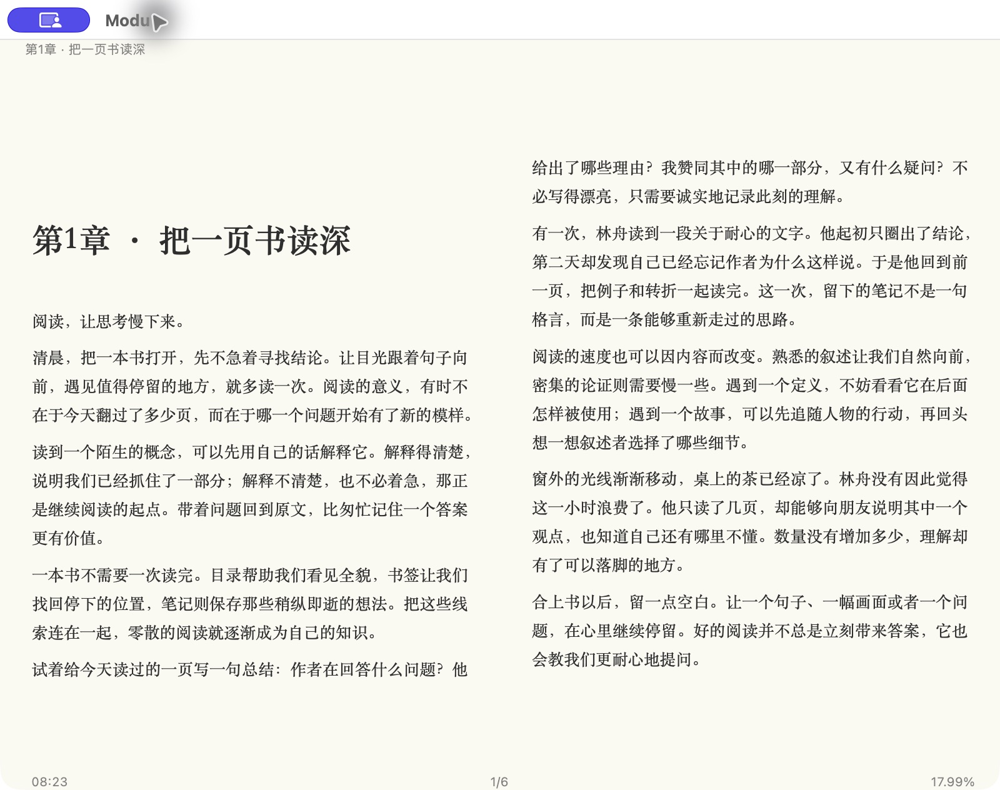

### 竖排与存储

竖排阅读可选择红色边框和正文分栏线，标题置右、页码置左，中文环境显示中文数字。注释字号按实际段落正文的 80% 计算，不按注释序号计算；弹窗最多占屏幕面积 25%，竖排长注释左右滚动。

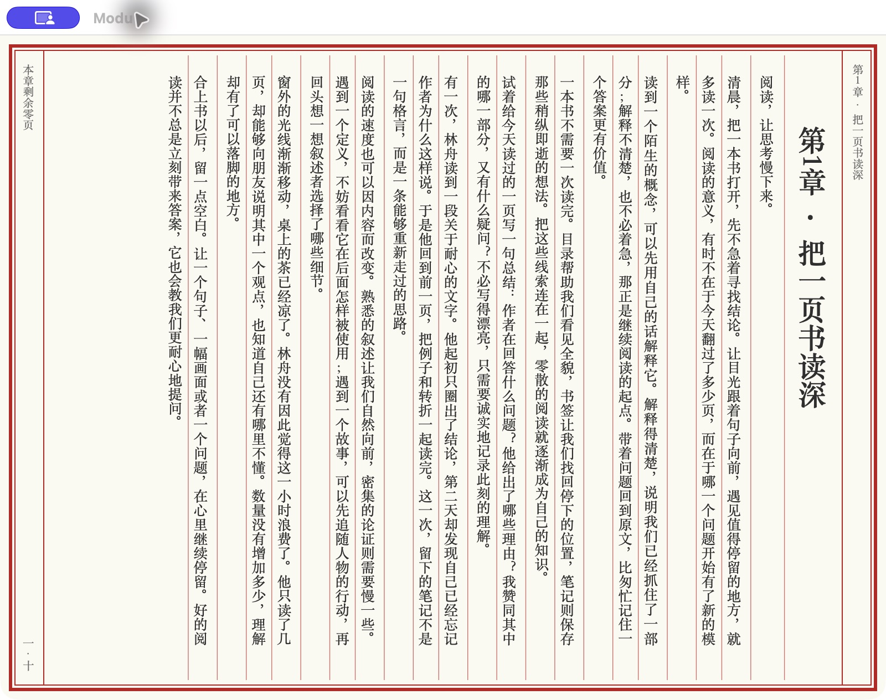

Android 主要书库数据迁移至 `Android/data/com.modu.reader/files`，首次升级会先校验迁移，再打开书库；旧私有目录副本保留，遇到冲突不会直接覆盖。密钥与偏好设置仍保留私有位置。请先备份、覆盖升级，不要卸载或清除数据；Android/data 仍受系统访问限制，不能代替备份。详见[迁移说明](docs/testing/android-app-storage.md)。

### 中英文独立字体

阅读样式中可分别设置「中文／正文字体」和「英文字体（字母、数字）」。英文字体默认跟随正文；选择独立字体后，拉丁字母、数字和西文标点使用该字体，汉字及中文标点保留正文字体，横排、竖排与注释均适用。从英文入口导入 TTF/OTF 会自动应用到英文，不改变中文选择；PDF 等固定版式文件不承诺重排字体。

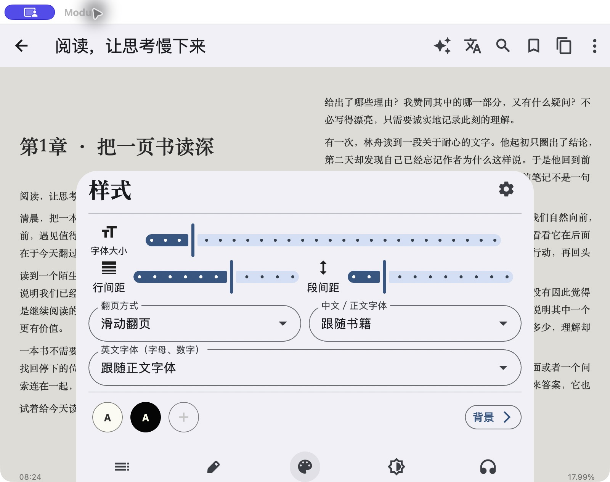

### 语言与外观

在「设置 → 外观」选择跟随系统或手动指定语言，并调整主题、主题颜色、OLED 与电子墨水模式。内置 AI 提示词随应用语言切换，自行编辑的提示词保留原文。

| 外观与主题 | 应用语言 |
| --- | --- |
| 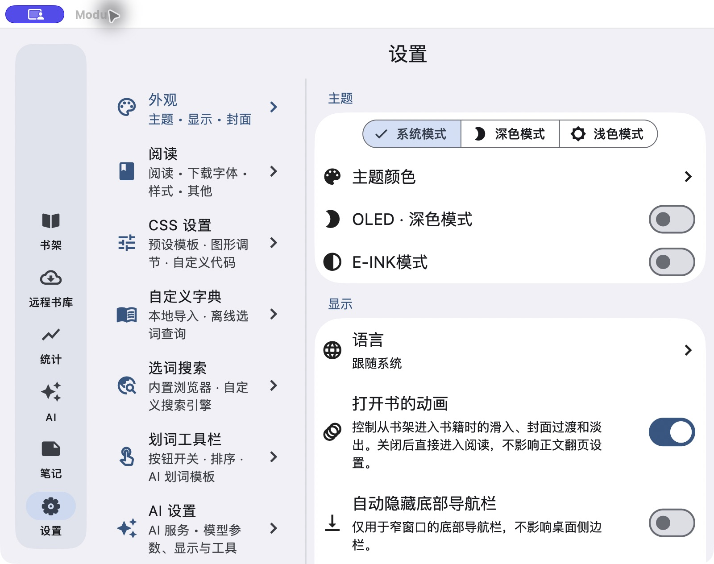 | 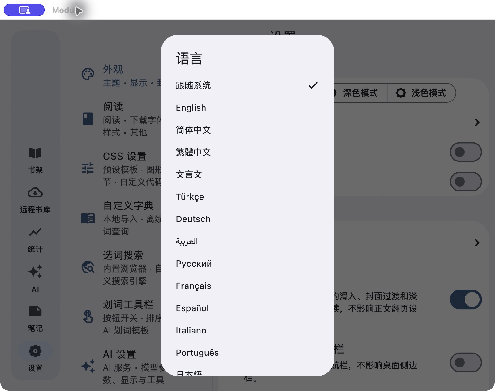 |

### 自定义 CSS 方案

在「设置 → CSS 设置」管理最多 32 套命名模板，附 13 个可编辑预设。通过开关、颜色选择和滑块调整文字、背景、下划线、字体、字重、行距、缩进等模块，也可叠加自定义 CSS 代码。支持多套独立开关、组合应用、复制和文件导入导出，以及正则文字高亮规则。

阅读页仅需选择并应用模板；参数统一在设置中编辑。每本书在本机记住所选模板，也可跟随默认。已有 CSS 会保留，修改共享模板会影响使用它的书籍。详见 [CSS 预设](docs/CSS_PRESETS.md)。

| 多套方案管理 | 常用预设模板 |
| --- | --- |
| 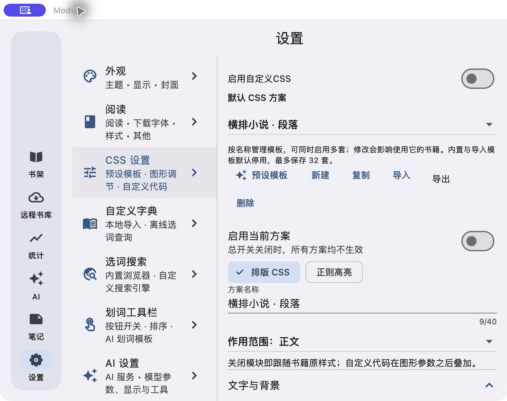 | 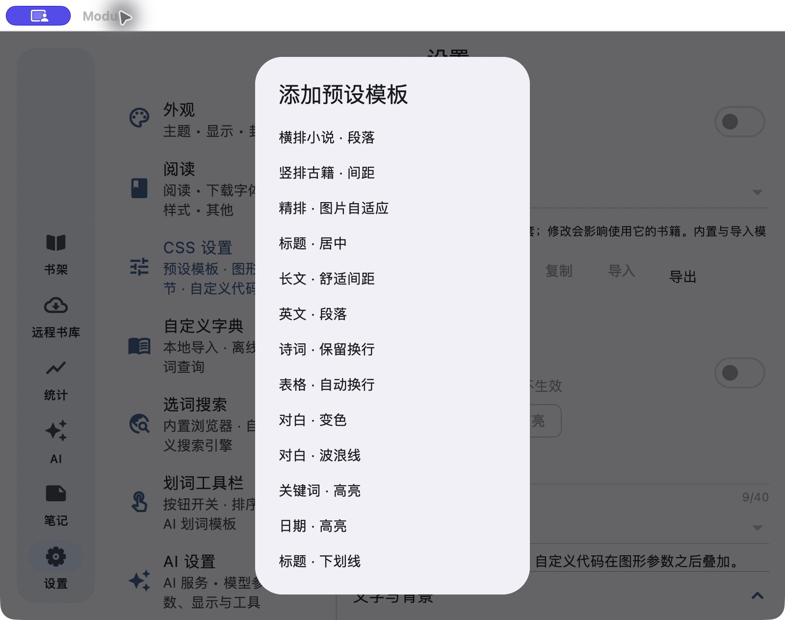 |

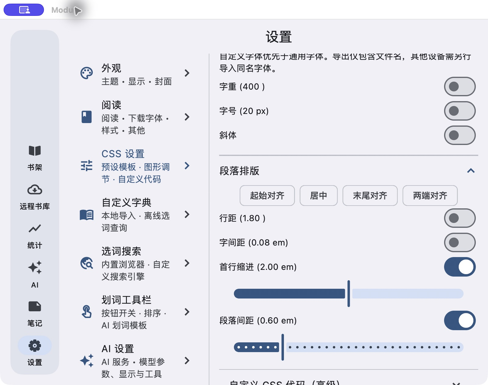

阅读页底部「样式」中的「字体粗细」位于字体大小与行间距之间，范围为 0.5–2.0，每档 0.1，1.0 为正常粗细。固定字重字体可开启旁边的「模拟加粗」，在 1.1–2.0 范围附加同色描边；不能把固定粗体变细。开关默认关闭，随阅读样式保存和备份。

### 清晰的笔记导出

复制、TXT 和 CSV 导出以 `原文：【…】` 标明摘录，多段原文放在同一对括号内，批注与原文分开。Markdown 在此基础上高亮备注，并显示笔记的创建或最后修改时间。导出附带 `modu:` 原文位置链接，可在已安装默读且含对应书籍的设备上返回阅读位置。

### WebDAV 远程书库

在「设置 → 远程书库设置」填写书籍目录的完整地址、用户名和密码，测试并保存后，从首页「远程书库」浏览。点击文件夹进入子目录，使用「上一级」或「根目录」返回；书籍右侧的下载按钮会将文件下载并导入本地书架，之后可离线阅读。支持进度显示、取消和重复书籍检查，单文件上限 512 MiB，一次下载一本；离开此标签会取消未完成的下载。

书库连接独立于 WebDAV 同步，只读取和下载，不上传或删除服务器文件。支持匿名访问和用户名/密码认证；推荐 HTTPS 和专用只读账号。地址、用户名和密码保存在本机应用配置中，重启后仍保留，本地不额外加密。开启「同步 API Key」后，书库配置及密码跟随 WebDAV 自动同步，以 AES-256-GCM 加密，各设备需使用相同同步加密密码。在“全局设置备份”选择包含账号、密码和 API Key 后可主动导出书库配置；主动导出不加密，默认排除这些凭据。清除连接会删除保存的密码，并同步到其他已开启该开关的设备，不删除书籍或服务器文件。

远程书库配置随“设置 → 高级 → 全局设置备份”统一迁移，支持设置文件和 `modu:` 链接。**账号、密码和 API 接口配置由独立开关控制，默认关闭；开启后导出的内容未加密，不要公开分享。** 关闭时导入也不覆盖本机凭据。导入前校验并确认，不自动连接服务器。添加/修改时间来自服务器。

设置文件保存成功后，会显示完整保存位置，可直接复制路径。Windows 的设置文件默认保存在当前用户的 Downloads（下载）文件夹；其他平台以保存对话框选择的位置为准。

### 手机翻页方式

滚动模式下，点击翻页或使用翻页快捷键的步长可在阅读设置中调为阅读区域的 80%～100%，默认 80%。自由滚动不受此步长限制。桌面正文支持方向键翻页；在 AI 输入框内，方向键仍用于移动光标。

阅读样式 → 更多设置 → 其他提供「仅点击翻页」开关，默认关闭。开启后，分页模式下滑动、拖动不翻页，也不触发上下拉手势，点击翻页仍有效；关闭后恢复滑动翻页。不影响选词、快速标记和滚动阅读模式，桌面端不显示此移动端开关。

桌面和手机均可点击正文显示章节进度与翻页控制，拖动滑块预览章节标题。下图为 Mac 版的上一章、上一页、下一页和下一章按钮。

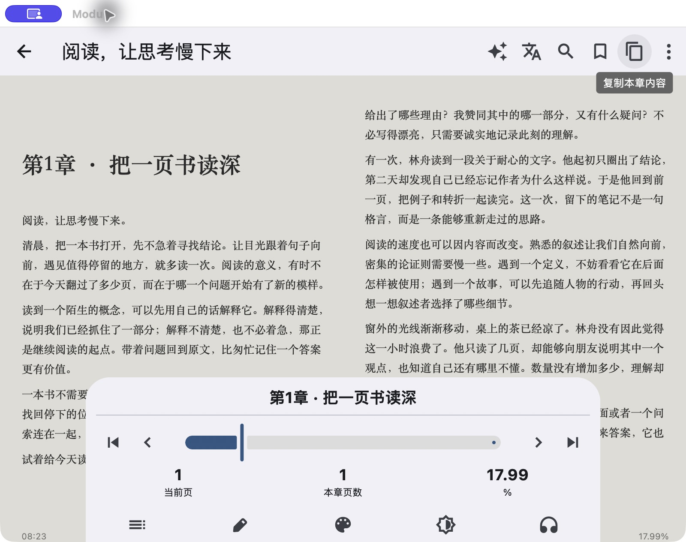

### 手机快速标记

右上角「标记后弹出菜单」按钮控制松手保存高亮后是否立即打开选中菜单，默认关闭，选择在本机记忆。

在同一章节内，翻页后首尾相连的同色、无批注高亮可自动合并为一条；中间漏字、隔有图片或已有批注时保持独立。

打开可重排电子书，点击阅读页上方的画笔按钮开启「快速标记」。不必长按：直接从文字起点划过需要摘录的内容，松手即保存高亮。标记沿用当前高亮颜色，进入原有笔记列表；重复标记同一位置不会覆盖已有批注。

开启时正文滑动用于选取；轻点正文可打开阅读控制栏，点击常驻的「快速标记中 · 退出」恢复正常翻页与滚动。每次进入书籍默认关闭，桌面端不显示此功能。PDF、扫描图片与固定版式不支持快速标记；它不会自动跨页划选。

### 围绕阅读内容使用 AI

每个模型可独立设置推理强度，包括为支持的模型选择「关闭推理」；全文翻译使用所选模型的参数。服务端是否支持关闭取决于具体模型与接口。

首页 AI 适合书架、笔记和阅读记录相关的提问；阅读页 AI 适合当前书籍、章节或选中文字。首页提供一组快捷提示词，书内则使用已启用的阅读技能。两者的上下文不同，不应把首页问题自动当作“当前章节”的问题。

在「设置 → AI 设置 → 供应商配置中心」中添加或编辑模型，可分别设置接口地址、模型名称、API Key、温度、最大输出 Token 和上下文轮数。支持 OpenAI 兼容、Claude、Gemini 等协议；预设包含 OpenAI、Claude、Gemini、DeepSeek、智谱 GLM 和 OpenRouter，也可自定义兼容接口。模型列表、工具调用和参数范围仍取决于服务商实际支持情况。

内置供应商详情支持「恢复默认」：重置接口与参数、清空已保存密钥并恢复默认启用状态，需要确认后执行。自定义供应商可在列表滑动删除，或进入详情页删除。

AI 工具可以按需开关，包括查书、查笔记、检索正文、读取章节、查看阅读记录和生成思维导图等。全书总结结合已获取的正文与检索结果，重要内容可回到原文核对。

### 阅读技能与自定义提示词

AI 阅读技能默认显示在对话输入区，可通过开关收起；内置与自定义技能均可启停、混合排序。AI 正文字号可独立设置；思维导图支持全屏查看、缩放移动、节点展开/折叠及导出 PNG、SVG、Markdown、FreeMind（`.mm`）和 JSON。

开启「先填入输入框」后，可在技能模板上补充章节范围等要求，再手动发送；该选项默认关闭，关闭时点击技能直接发送。设置页面中的开关与 AI 对话中的选项保持一致。

在当前对话或打开的历史对话中直接输入追问，会沿用本轮上下文继续回答。历史入口使用时钟图标，位于右上角更多选项左侧；新建对话或发起新的技能、划词任务仍可开始独立对话。

| 技能 | 用途 |
| --- | --- |
| 本章总结 | 梳理当前章节的主要内容、情节和主题 |
| 全书总结 | 概括已获取的全书内容与结构 |
| 概念解析 | 解释概念、术语与抽象观点 |
| 论证分析 | 拆解论点、推理与支持证据 |
| 人物追踪 | 整理人物关系及发展变化 |
| 金句摘录 | 提取值得记录的原文片段 |
| 阅读指南 | 生成阅读建议、讨论问题与反思方向 |
| 智能翻译 | 结合书籍语境翻译内容 |
| 词汇助手 | 解释生词、习语和专业表达 |
| 思维导图 | 将内容整理为层级结构 |

点击技能可打开提示词，修改后保存，也可恢复默认；自定义技能与内置技能一起出现在阅读 AI 面板中。「回忆前文」「翻译与词典」「全文翻译」等功能提示词也集中在同一设置页管理。

| 阅读技能管理 | 查看与编辑提示词 |
| --- | --- |
| 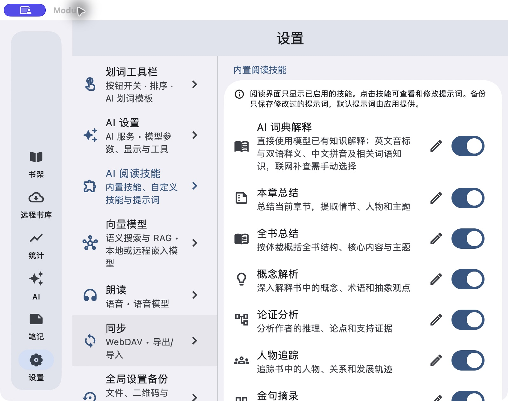 | 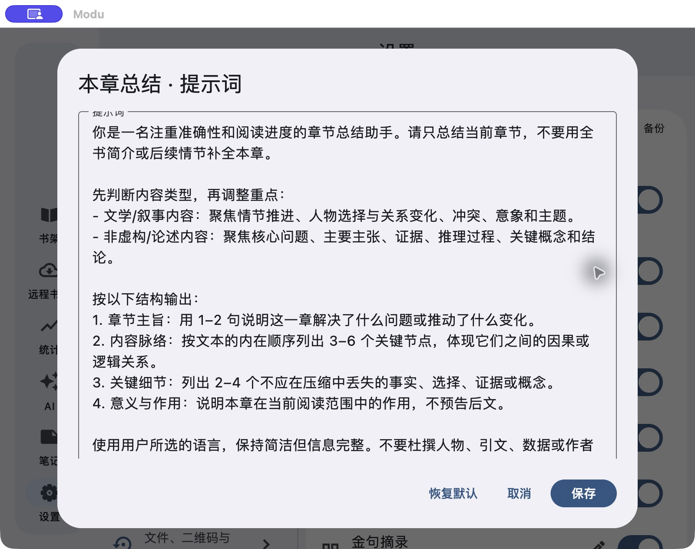 |

### 划词工具栏与 AI 模板

在「设置 → 划词工具栏」开关和拖动排序内置动作、标注工具及自定义 AI 命令，可调整名称、图标、提示词和显示数量。常用 AI 模板默认关闭，与 AI 阅读技能分开管理；发起新的划词 AI 任务时开启新对话，使用阅读 AI 弹窗，生成结束后回到首段；在该对话输入框内手动追问则延续上下文。设置备份只保存内置提示词的用户改动，不重复保存默认模板。

安卓长按首次选中时，可自动扩展到所在词语或整段，并直接显示拖动手柄；随后拖动手柄自由调整范围，不会再次强制匹配选区。

「AI 知识」仅作为划词模板保留，简要介绍词语的含义、背景和相关知识，按选中文字的语言回答，不默认附加拼音、翻译或例句。所有划词 AI 命令都可选择「仅选中文字」（默认）或「结合上下文」，并独立勾选联网搜索。不联网时先使用模型已有知识；需要核实时，也可在原对话输入 **“确认联网搜索”**，由同一模型根据维基词典、维基百科和百度百科资料整理并附来源，无需额外搜索 API Key。

| 工具开关与排序 | 独立管理 AI 划词模板 |
| --- | --- |
| 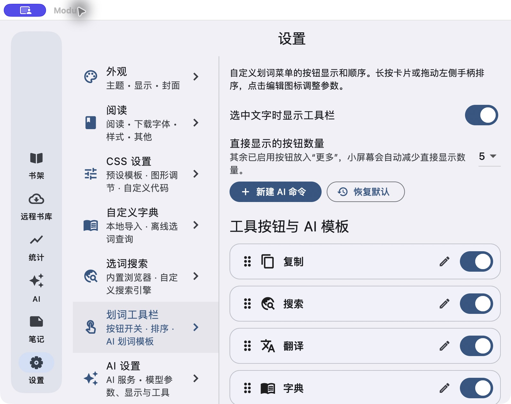 | 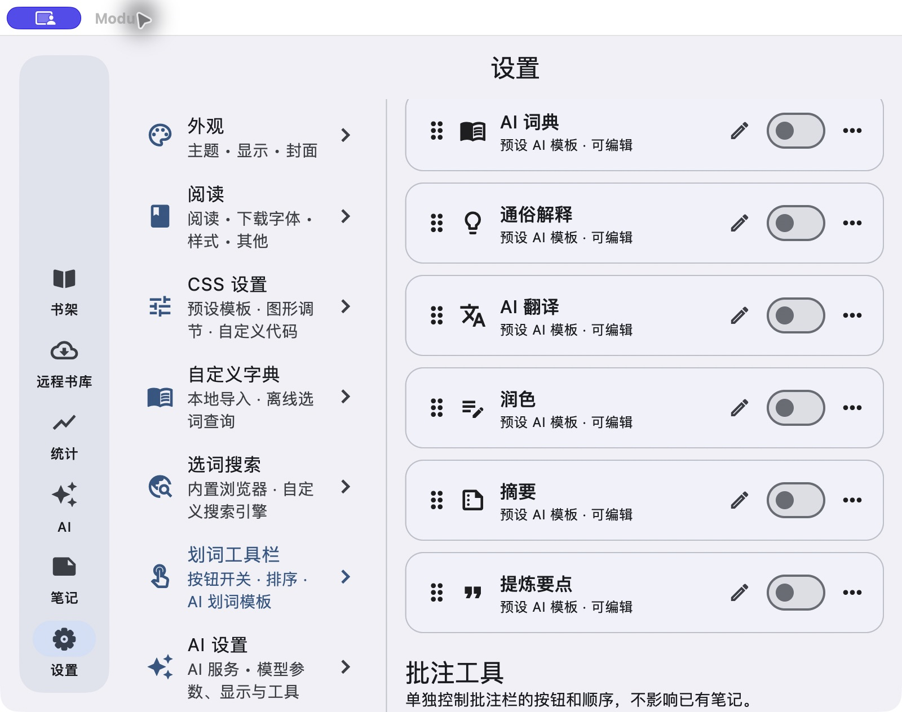 |

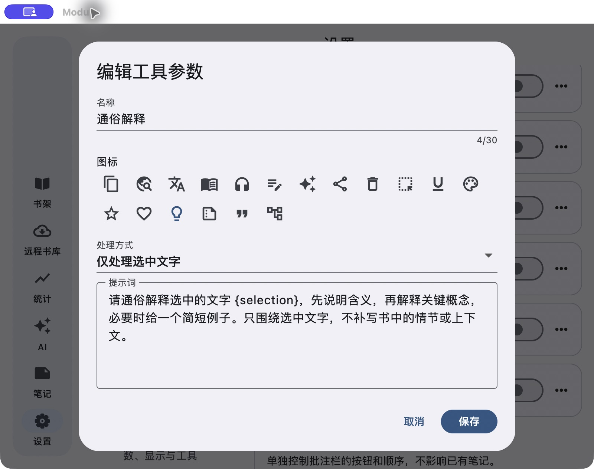

### 书籍向量化与本地模型

已下载模型可在模型设置中管理和删除。较大本地索引采用流式读取，支持最高 1 GiB 的索引文件。

自由对话的正文搜索复用同一套关键词/向量混合检索；阅读技能继续限定当前章节、选文或阅读范围。向量索引仅保存在本机，不通过 WebDAV 上传或下载；各设备按需建立索引，已有本地索引保留。详情见[本地索引与阅读控制说明](docs/INDEX_SYNC_AND_READING_CONTROLS.md)。

在书籍弹出菜单中选择「向量化」或「重新向量化」。不同书籍进入后台队列，不必停留在索引页面；任务状态和失败提示用于判断索引是否真正完成。要自动处理新书，还需在「设置 → 向量模型」同时启用向量模型和「导入后自动向量化」。自动向量化默认关闭。

| 本地 ONNX 模型 | 适用语言 | 向量维度 |
| --- | --- | --- |
| all-MiniLM-L6-v2 | 英文 | 384 |
| BGE Small EN v1.5 | 英文 | 384 |
| BGE Small ZH v1.5 | 中文 | 512 |
| Multilingual E5 Small | 多语言 | 384 |

以上四个模型及分词器**按需下载，不再内嵌在安装包中**。在「设置 → 向量模型 → 模型下载源」选择 [Gitee 镜像](https://gitee.com/sobranie2406/modu-models/releases/tag/models-v1)或 Hugging Face（默认），再点击所需模型的「下载并使用」。镜像不可用时可手动选择 Hugging Face，不会静默更换来源。下载校验大小与 SHA-256，完成后可离线推理，无需 API Key。旧版已准备的完整模型继续复用，启动和索引不会自动下载缺少的模型。默认选择中文 BGE，自动向量化默认关闭。也可选择远程嵌入 API。切换模型后应对旧书重新向量化；聊天和向量模型是两套配置。

本地向量计算在设备上完成；使用在线聊天、翻译、嵌入或语音时，相关文本发送给你选择的服务。

### 翻译与朗读

移动端正文图片按阅读区域等比适配；注释框随内容调整，最大为可见阅读窗口面积的 25%，超出内容可滚动查看。

朗读到章末会自动接续下一章标题和正文，空白章节继续往后衔接。

选中文字或点击阅读页上方 AI 旁的翻译按钮即可翻译，支持 Google 翻译、AI 翻译和 DeepL/DeepLX，也可在应用内打开百度、有道网页翻译。选文翻译统一正文字号并限制标题字号，长译文在与 AI 对话同规格的弹窗内滚动阅读。


点击正文即可显示进度滑块和上一章、上一页、下一页、下一章按钮，拖动时预览章节标题。页眉页脚的「章节进度」显示章节序号，「本章进度」显示本章当前页与总页数。选中已有高亮或下划线的局部或全部，再点垃圾桶并确认，可删除相交的完整标注及其备注；确认框不会被工具条和颜色栏遮挡。阅读器也支持常见图片式注释引用。

全文翻译的「停止翻译」放在阅读工具栏的翻译菜单中，正文上不再悬浮停止按钮。

### 听书与声音提示词模板

在「设置 → 朗读」选择系统语音、Edge、小米 MiMo、OpenAI 兼容或通义 DashScope。阅读中打开朗读面板即可听书，也可选中文字后点击「朗读」，从指定位置开始；章末自动接续下一章。

**先选模板，再按喜好调整声音，无需从零写提示词。** MiMo 的「官方预置音色」模式可选择音色并搭配讲述风格；「文字设计音色」模式则通过性别、年龄感、音色、语气和节奏描述设计声音。

| 模板类型 | 内置示例 |
| --- | --- |
| 日常与故事朗读 | 自然听书、睡前轻读、小说演绎 |
| 内容表达 | 知识讲解、古文诵读、新闻播报 |
| MiMo 音色设计 | 温柔女声、清亮女声、沉稳男声、温暖男声、长者讲述 |
| OpenAI 兼容描述 | 上述朗读风格，以及温暖柔和、低沉稳重、清亮轻快 |

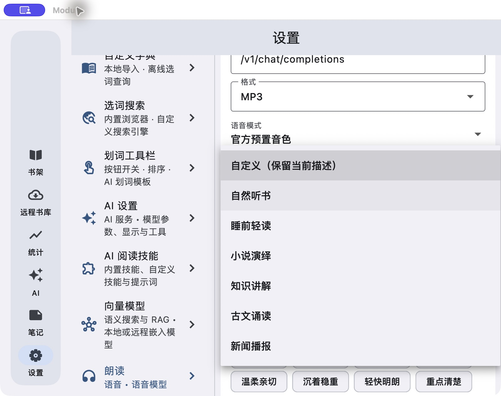

选择「描述预设」会填入可编辑的提示词；点击「吐字清晰、自然停顿、舒缓节奏、情绪克制」等快捷词可追加要求，最后点击「保存设置」。例如，自然听书模板为：

> 以自然的讲述方式朗读，吐字清楚，句间停顿适中，情绪平稳，适合长时间听书。

可继续补充「语气温柔亲切」或「对关键内容适当重读」，形成自己的听书风格。提示词仅作为声音指令，不会作为正文朗读；模板是默读提供的可编辑描述，不是新增的官方音色或声音克隆。

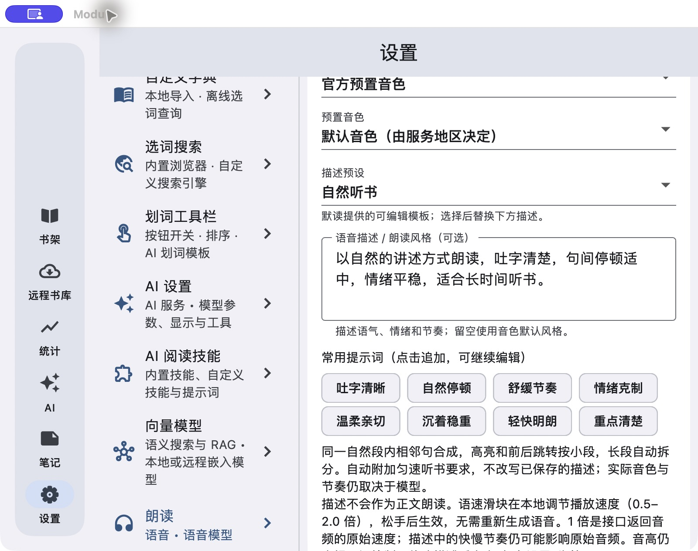

OpenAI 兼容服务提供独立的「启用语音提示词」开关、描述预设和编辑框；选择模板不改变 Voice 音色。开启后自动附加匀速听书要求，MiMo 也会附加稳定讲述要求。在线朗读最高支持 4 倍语速，2 倍之后依次为 3 倍、4 倍；MiMo 的语速滑块直接调整本地播放倍率（0.5–4.0 倍），松手生效，无需重新生成语音。提示词中的节奏描述用于指导生成风格；OpenAI 兼容服务使用提示词调节语速、音高时，可将播放器语速与音调设为 1.0。`tts-1` / `tts-1-hd` 不发送提示词，其他兼容接口可按支持情况关闭开关。

阅读页提供小型朗读快捷栏，可回到朗读位置、播放/暂停、从当前阅读位置开始朗读或打开朗读设置。

MiMo、OpenAI 兼容、通义 DashScope 和 Edge 在线朗读将同一自然段的相邻句子合并合成，长段自动拆分，高亮和上一段/下一段与播放范围一致；系统语音保持逐句朗读。首段优先生成，播放期间预加载后续段落，减少等待；语音失败时保留位置供重试。已保存的听书设置可通过「全局设置备份」迁移。

### 同步与密钥安全

阅读时可开启定时同步，选择 1、2、3、5、10、15、30 分钟或 1 小时，仅在前台阅读时生效，遵循自动同步和仅 Wi-Fi 设置。同步过程不弹提示，最终显示成功或失败原因。

- WebDAV 在配置地址下的 `modu` 目录同步书库、笔记和阅读进度，不需要使用默读专属云账号。旧目录的迁移方法见对应 Release 说明。
- 书籍、笔记、书签和阅读位置逐条合并；阅读位置采用最近操作而非最远进度，新阅读时长按记录去重，删除保留标记。同步后拒绝旧页面进度回写，笔记冲突保留草稿。字体、主题图片、本地字典和向量索引不随书库同步。可靠 ETag 服务使用条件写入，其他服务使用校验过的独立记录批次；迁移与服务器要求见[同步说明](docs/WEBDAV_RECORD_SYNC.md)。
- 「同步 API Key」默认关闭，独立于 WebDAV 总开关；开启时需要设置独立密码并确认风险。
- 敏感服务配置以 **AES-256-GCM** 加密后写入同步数据库。其他设备需要同一密码；密码不随数据库同步，遗失无法找回。
- 加密不代表书籍、笔记和整个备份都被加密，也不能代替可信的 WebDAV 服务与强密码。
- **设置文件和配置链接不是加密数据**，可能包含密码或 API Key。不要放入公开截图、Issue 或聊天群；它们与加密密钥同步是不同功能。

### 数据库备份

「设置 → 同步 → 数据库备份」导出 `Modu-Backup-*.zip`，包含本机书籍、封面、书库数据库（笔记、高亮、书签及阅读记录）、字体、背景图片、AI 对话历史和一般设置。先下载需要迁移的书籍；服务配置与凭据默认排除，可在导出窗口选择加密包含。

Windows 默认保存到当前用户的 Downloads（下载）文件夹，通常为 `C:\Users\<用户名>\Downloads`；Mac、Linux 和手机端以系统保存窗口选择的位置为准。成功后显示完整路径或文件名，并可复制查找。导入选择 ZIP，无需解压；导入会校验后替换现有数据，不会合并，请先备份当前数据，恢复后重启默读。这与只迁移偏好的“全局设置备份”不同。

### 全局设置迁移

外观、阅读、CSS、AI 技能、朗读与翻译等设置统一导入导出，支持设置文件和 `modu:` 链接。全量设置可能超出二维码容量，因此不再提供二维码导出或图片导入，推荐使用设置文件备份。账号、密码和 API Key 由独立开关控制，默认关闭；开启后导出为可还原的明文凭据，请勿公开分享。书籍与笔记使用书库备份或同步，不包含在设置文件内。

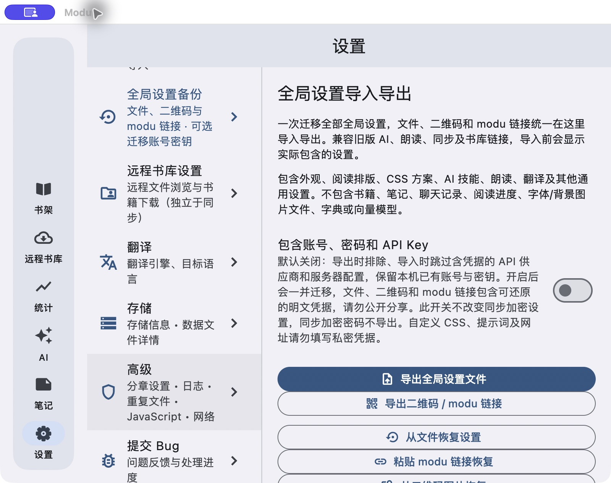

## 开始使用

1. 从 [Releases](https://github.com/sobranie2406/modureader/releases) 下载对应系统和架构的包，按安装指南完成安装。
2. 在书架添加电子书，打开后即可阅读；不使用 AI 时无需填写任何 API Key。
3. 需要 AI 时，在「设置 → AI 设置」配置模型，并先做连接测试。
4. 需要语义检索时，在「设置 → 向量模型」按需下载本地模型（默认中文 BGE），再从已下载书籍的菜单建立索引；也可配置远程向量接口。
5. 按需选择翻译、朗读与同步服务。详细操作、参数含义和安全注意事项见[设置指南](docs/SETTINGS.md)。

## 问题反馈

各版本的更新记录见 [Release 说明](https://github.com/sobranie2406/modureader/releases)。

发现问题时，请在本仓库 [Issues](https://github.com/sobranie2406/modureader/issues) 提供版本、系统与架构、复现步骤和不含私人资料的示例。请勿提交 API Key、WebDAV 密码或含凭据的设置文件及链接。

## 从源码构建

固定 Flutter 版本记录在 [.github/flutter-version](.github/flutter-version)，依赖锁定在 pubspec.lock。
需要对应平台的 Flutter 原生工具链；本地 tokenizer 的源码编译还需要 Rust（移动端需相应 Rust target）。

```sh
flutter pub get
flutter gen-l10n
dart run build_runner build --delete-conflicting-outputs
flutter test --concurrency 1
# 在对应宿主平台运行：
flutter build macos --release --build-name "$(python3 scripts/release/verify_mobile.py --apple-build-name)"
# Android 的 release 签名先按 docs/RELEASING.md 配置
flutter build apk --release --target-platform android-arm64,android-x64 --split-per-abi
```

完整可复现的构建/打包步骤以 [.github/workflows/build.yaml](.github/workflows/build.yaml) 和 scripts/release 为准。
Dart 包名暂时保留 anx_reader，以兼容现有 import；用户可见品牌及应用 ID 为 Modu / com.modu.reader。

## Star 趋势

感谢每一位支持默读的读者。点击图表可在 [Star History](https://www.star-history.com/?repos=sobranie2406%2Fmodureader&type=date&legend=top-left) 查看详细趋势。

<a href="https://www.star-history.com/?repos=sobranie2406%2Fmodureader&amp;type=date&amp;legend=top-left">
  <picture>
    <source media="(prefers-color-scheme: dark)" srcset="https://api.star-history.com/chart?repos=sobranie2406%2Fmodureader&amp;type=date&amp;theme=dark&amp;legend=top-left" />
    <source media="(prefers-color-scheme: light)" srcset="https://api.star-history.com/chart?repos=sobranie2406%2Fmodureader&amp;type=date&amp;legend=top-left" />
    
  </picture>
</a>

## 开源许可与来源

整体按 **GPL-3.0-or-later** 发布，见 [LICENSE](LICENSE)。
Anx Reader 的 MIT 版权与许可保留在 [LICENSES/Anx-Reader-MIT.txt](LICENSES/Anx-Reader-MIT.txt)；
ReadAny 的版权与许可保留在 [LICENSES/ReadAny-GPL-3.0-or-later.txt](LICENSES/ReadAny-GPL-3.0-or-later.txt)。
固定上游提交、修改范围和第三方归属见 [UPSTREAM.md](UPSTREAM.md)、[NOTICE](NOTICE)。
分发二进制时请保留许可、注明修改，并提供对应版本的完整源码与构建脚本。

[隐私说明](PRIVACY.md) · [安全报告](SECURITY.md) · [参与贡献](CONTRIBUTING.md)
