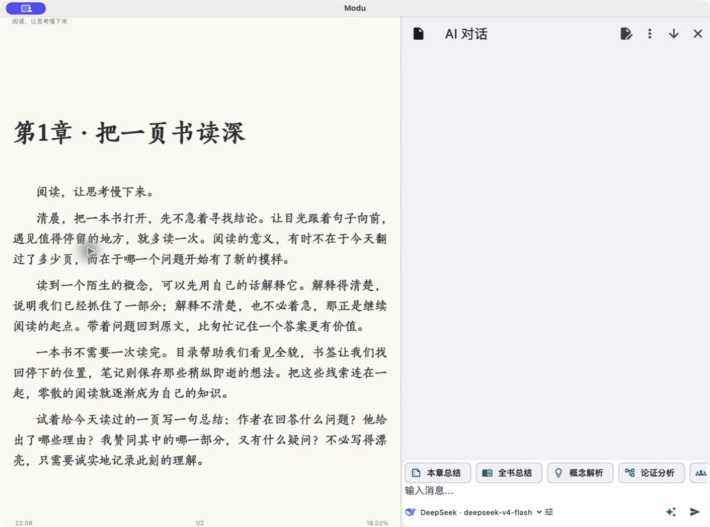
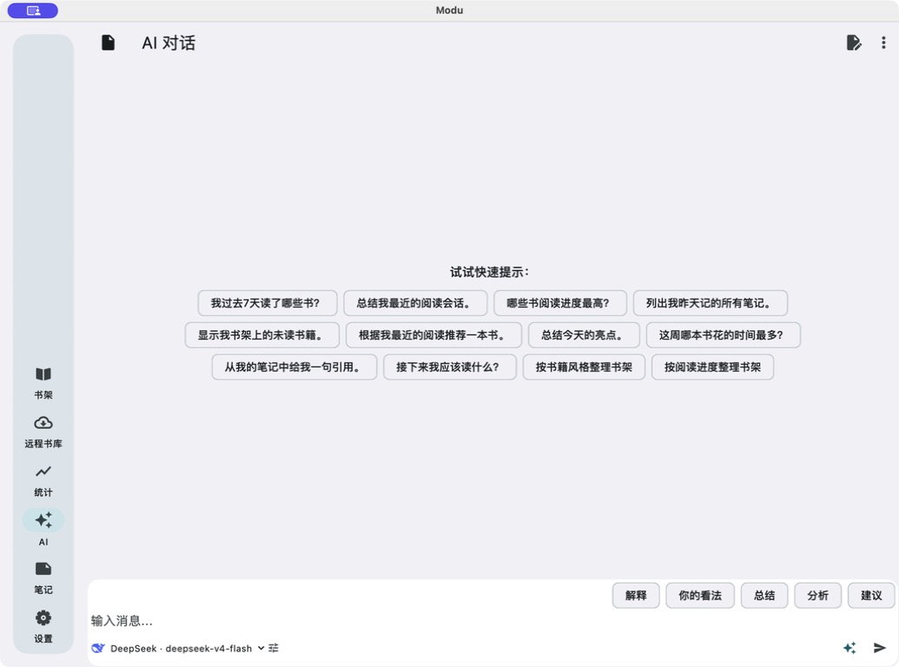
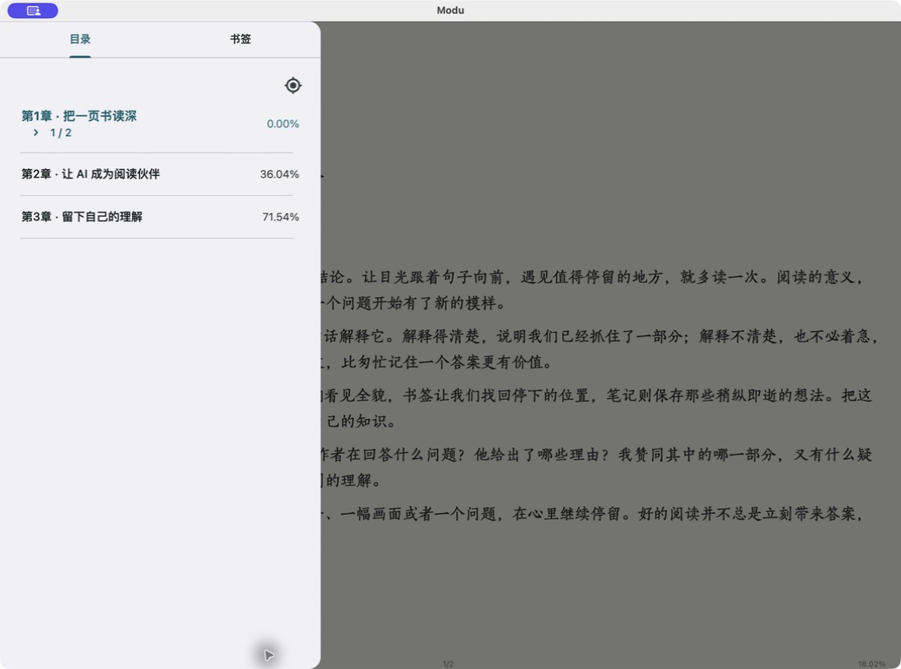
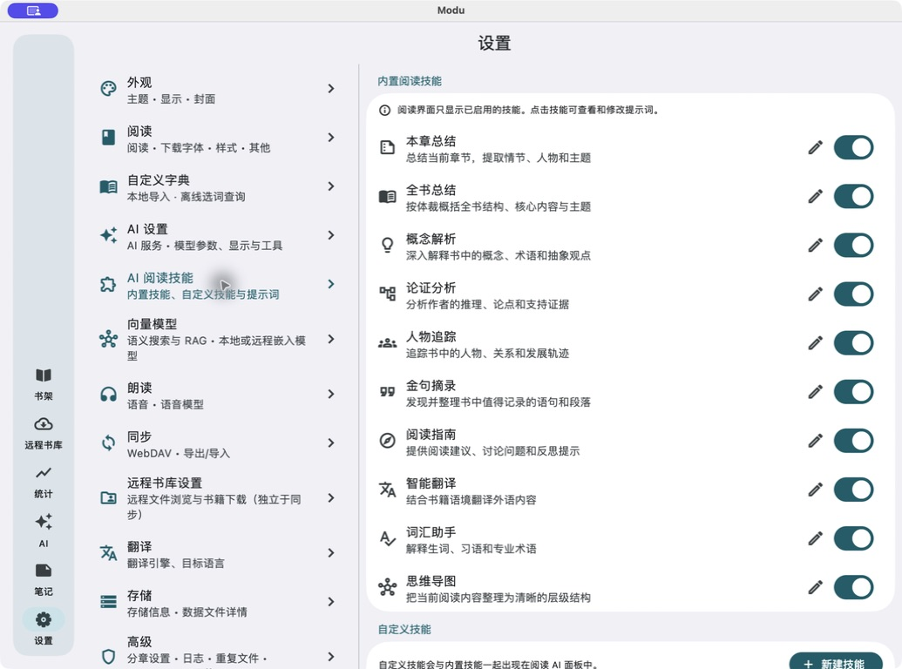
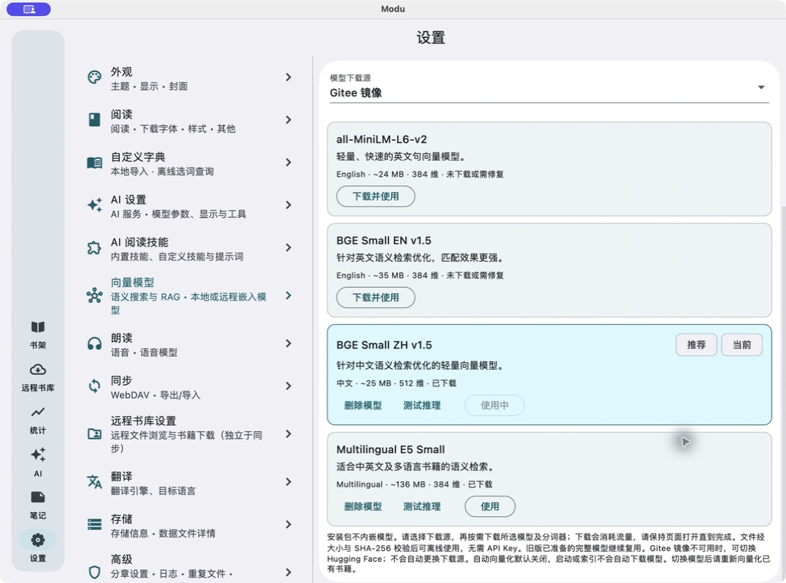

# Modu Reader · 默读

[简体中文](README.md) | [English](README_EN.md)

<p align="center"></p>

**Derived from [Anx Reader](https://github.com/anxcye/anx-reader) and [ReadAny (Reader Any)](https://github.com/codedogQBY/ReadAny). Thanks to the authors and contributors of both projects.** This is an independently modified derivative, not an official release of either upstream.

Modu is an open-source AI ebook reader built with Flutter. It brings books, notes, reading progress and AI conversations together: read first, then ask questions about the current chapter. For semantic search, index your books using local models or a remote embedding service.

**Local reading does not require an AI account.** AI, online translation and online speech are optional; availability and costs depend on your chosen providers. The project is in **Beta**. Implementing a feature, building a package and validating it on a device are different milestones—see [Known limitations](#known-limitations-and-test-coverage).

[Features](#features) · [Screenshots](#screenshots) · [Getting started](#getting-started) · [Settings guide (Chinese)](docs/SETTINGS.md) · [Downloads](#downloads)

## Downloads

[GitHub Releases](https://github.com/sobranie2406/modureader/releases) · [Build status](https://github.com/sobranie2406/modureader/actions) · [Report an issue](https://github.com/sobranie2406/modureader/issues)

| Platform | Published architectures | Package and limitations |
| --- | --- | --- |
| Windows | x64, ARM64 | EXE installer with shortcuts and an uninstaller; no commercial code signature; requires WebView2 Runtime |
| Linux | x64, ARM64 | DEB for Debian 13 (trixie); install with APT to resolve system dependencies |
| Android | x86_64, arm64-v8a | APK signed with the project's dedicated key; verify the download source before installing |
| macOS | x64, ARM64 | DMG; drag the app to Applications; unnotarized, not an App Store release |
| iOS | ARM64 devices | iOS 16+; **unsigned.ipa** has no Apple distribution signature and cannot be installed directly; you must sign it yourself using a valid signing identity |

Here, x64 means x86-64; ARM64 is also 64-bit. There is no x64 iPhone/iPad device package.
Beta 3 (build 6329): [downloads and release notes](https://github.com/sobranie2406/modureader/releases/tag/v0.1.0-beta.3). Nine application packages are targeted; check the release page for available assets and their SHA-256 files. Architecture, signature and checksum checks are not a substitute for functional testing on devices.

Beta 3 also corrects Xiaomi MiMo's official protocol, defaults and WAV playback; live-account listening remains unverified. Beta 3 fixes skipped first sentences and text headings, asynchronous chapter advancement, and pause/resume handling in read-aloud. Speech synthesis or playback failures now pause with an error instead of silently skipping text. Native macOS system speech passed testing; the reported book and Android device still need verification. See the [read-aloud test record (Chinese)](docs/tts-reader-regression.md). The following Beta 2 fixes remain included.

Beta 2 corrects reader background image and color handling, adds Settings → Report a Bug, removes app vibration feedback, and updates Android ONNX Runtime to 1.24.3. The local-model crash reported on Xiaomi 15 Ultra still needs verification on that device; see the [verification record (Chinese)](docs/android-onnx-haptics-verification.md).

Desktop apps use native installers, not ZIP or tar.gz downloads. Android `-notices.zip` files contain license information; GitHub's automatically generated `Source code (zip)` downloads contain source code. Neither is an application installer. We do not provide scripts to bypass operating-system security protections. See [Release and installation instructions (Chinese)](docs/RELEASING.md) for details.

## Features

This table describes functionality integrated into the current codebase, not a claim that every feature has passed acceptance testing on every platform.

| Area | What it does | Where to find it |
| --- | --- | --- |
| Library and import | Import EPUB, PDF, MOBI, AZW3, FB2 and TXT; filter by reading status, search, group books and manage tags | Home → Library; add button or book menu |
| Reading and layout | Chapter navigation, progress, paginated/scrolling modes, fonts, sizes, spacing, backgrounds and themes; rule-based TXT-to-EPUB conversion | Reader; Settings → Reading |
| Highlights and notes | Highlight text, record thoughts and organize notes by chapter; copy or export Markdown, TXT and CSV | Text selection menu; Home → Notes |
| Reading statistics | Reading time, trends, heatmap and per-book records | Home → Statistics |
| AI conversations | Home quick prompts, in-book questions and chat history; enabled tools access the library, contents, chapters, notes and reading records | Home → AI; reader AI panel |
| AI reading skills | Ten built-in skills with Chinese names; enable/disable, inspect/edit prompts and create custom skills | Settings → AI Reading Skills |
| Semantic search and RAG | Combined keyword and vector search, locally stored indexes, background indexing queue and reindexing | Book menu; Settings → Embedding Models |
| Translation | Free Google translation, AI translation and DeepL/DeepLX; selected-text and full-text translation entry points | Settings → Translation; bottom reader toolbar |
| Read aloud | System speech, Edge TTS and compatible online services; voice selection, previews and speech parameters | Settings → Read Aloud; reader playback controls |
| Sync and backup | WebDAV sync for books, notes and reading progress; local backups; separately enabled encrypted API-key sync | Settings → Sync |
| Configuration transfer | Import/export AI and WebDAV settings with codes, QR-code display and QR-code image import | AI Settings / Sync → Import and Export |
| Appearance and tools | System/dark/light themes, cover display, font import/download, network and logging options | Settings → Appearance / Reading / Advanced |

### AI grounded in your reading

Home AI is intended for library, note and reading-history questions. In-book AI focuses on the current book, chapter or selected text. Home offers quick prompts, while the reader uses enabled reading skills. Their contexts are different: a home-screen question should not automatically be treated as referring to a current chapter.

Add or edit models under Settings → AI Settings → Provider Configuration. Each model can have its own endpoint, model name, API key, temperature, maximum output tokens and number of conversation-history turns. OpenAI-compatible, Claude and Gemini protocols are supported. Presets include OpenAI, Claude, Gemini, DeepSeek, Zhipu GLM and OpenRouter; compatible custom endpoints can also be configured. Model discovery, tool calling and parameter ranges depend on the provider.

Enable AI tools as needed, including finding books and notes, searching text, reading chapters, inspecting reading records and generating mind maps. AI output can be wrong. Book summaries are limited by the text retrieved, search results and the model's context window; one request is not guaranteed to read an arbitrarily long book in full.

### Ten built-in reading skills

The built-in names are displayed in Chinese; their English meanings are provided below.

| Skill | Purpose |
| --- | --- |
| 本章总结 — Chapter Summary | Outline the current chapter's content, plot and themes |
| 全书总结 — Book Summary | Summarize available book content and structure |
| 概念解析 — Concept Explainer | Explain concepts, terminology and abstract ideas |
| 论证分析 — Argument Analyzer | Break down claims, reasoning and supporting evidence |
| 人物追踪 — Character Tracker | Track character relationships and development |
| 金句摘录 — Quote Collector | Extract noteworthy passages from the original text |
| 阅读指南 — Reading Guide | Suggest reading approaches, discussion questions and reflection topics |
| 智能翻译 — Smart Translator | Translate content in its book context |
| 词汇助手 — Vocabulary Helper | Explain unfamiliar words, idioms and technical expressions |
| 思维导图 — Mind Map | Organize content into a hierarchy |

Open a skill to inspect its prompt, edit and save it, or restore the default. Custom skills appear alongside built-in skills in the reader AI panel. Prompts for recalling previous content, translation/dictionary and full-text translation are managed on the same settings page.

### Book indexing and local models

Choose **Index** or **Reindex** from a book's pop-up menu. Books enter a background queue, so you can leave the indexing screen. Check task status and error messages to confirm completion. For automatic indexing of new imports, enable both the embedding model and **Automatically index after import** in Settings → Embedding Models. Automatic indexing is off by default.

| Local ONNX model | Languages | Embedding dimensions |
| --- | --- | --- |
| all-MiniLM-L6-v2 | English | 384 |
| BGE Small EN v1.5 | English | 384 |
| BGE Small ZH v1.5 | Chinese | 512 |
| Multilingual E5 Small | Multilingual | 384 |

The revised Beta 1 (build 6326) **bundles all four models and tokenizers**. Local inference needs no additional download or API key. Chinese BGE is selected by default and automatic indexing is off. The first upgrade from an older build also applies these defaults while retaining remote settings and keys; later manual choices are preserved. Model assets total about 208 MiB and are prepared locally on first use. Remote embedding APIs remain optional. Reindex books after switching models; chat and embedding settings are separate.

Local embeddings only mean that embedding computation happens on your device. Remote chat, embedding, translation or speech services still receive the relevant text. The whole AI workflow should not be described as completely offline.

### Sync and key security

- WebDAV syncs your library, notes and reading progress without a Modu cloud account.
- **Sync API Keys** is off by default and separate from the main WebDAV switch. Enabling it requires a separate password and acknowledgment of the risks.
- Sensitive service settings are encrypted with **AES-256-GCM** before being written to the sync database. Other devices need the same password. The password is not synced and cannot be recovered if lost.
- This does not encrypt all books, notes or the entire backup, and does not replace a trustworthy WebDAV service and a strong password.
- **Configuration codes and QR codes are not encrypted** and may contain passwords or API keys. Do not post them in public screenshots, issues or group chats. Configuration transfer is separate from encrypted key sync.

## Screenshots

These are actual macOS screenshots from an earlier Modu `v0.1.0-beta.1` build, not upstream screenshots or design mockups. They show the Chinese UI and selected settings, not necessarily revised-build defaults. Build 6326 bundles the model weights.

### Reading: text, fonts and themes

The original demo book *Reading: Let Your Thinking Slow Down* (《阅读，让思考慢下来》) is shown in the EPUB reader with a single-column layout, Chinese font, light theme and progress information. Font size, line spacing and columns can be adjusted in reading settings.


### In-book AI: read and ask side by side

The AI sidebar keeps the book text visible on the left. The right side provides the ten reading skills listed above, or you can type your own question.



### Home AI: start with a quick question

Home offers twelve quick questions about your library and reading records, covering recent reading, notes, unread books, reading time and library organization. The input area also provides general explanation, summary and analysis prompts.



These AI screenshots show real interface controls. **No model responses were generated or composited into them**, and they do not demonstrate model quality or endpoint availability. The demo book is original project content; screenshots contain no private books, API keys or private conversations. [Download the demo EPUB](docs/examples/modu-reading-demo.epub) to try it yourself.

<details>
<summary>More screenshots: chapter navigation, AI skills and local embedding models</summary>

### Contents and bookmarks



### AI reading skills and prompt management



### Local embedding models and automatic indexing



</details>

## Getting started

1. Download the package for your system and architecture from [Releases](https://github.com/sobranie2406/modureader/releases). Read the installation limitations first.
2. Add an ebook to the library and open it. No API key is required if you do not use AI.
3. To use AI, configure a model in Settings → AI Settings and test the connection.
4. For semantic search, index a book from its menu using the bundled Chinese model. Choose another model or configure an optional remote endpoint in Embedding Models.
5. Choose translation, read-aloud and sync services as needed. See the [Settings guide (Chinese)](docs/SETTINGS.md) for instructions, parameter explanations and security considerations.

## Known limitations and test coverage

- Original Beta 1 (build 6325) had missing Windows VC++ runtime files, insufficient Android tokenizer 16 KB alignment, an invalid Apple marketing version and a default system-voice issue. Build 6326 includes fixes and packaging checks. Check release notes and the internal build number to distinguish packages; old cached downloads do not update automatically.
- Current source uses the native default voice when no system voice is selected. Linux has no system TTS implementation: settings disable that option and explain the limitation. Users must explicitly choose an online service; Modu does not automatically switch or upload text. Online speech playback on Linux still needs device testing.
- Password-protected PDFs are not currently supported; scanned PDFs do not undergo OCR. DRM-protected books are not promised to work. Document layout and table-of-contents quality affect reading, text extraction and indexing.
- Free translation and Edge TTS require network access and may be rate-limited or changed by their providers. Paid services require your own valid settings. Preset model names are not guaranteed to remain available indefinitely.
- Actual UI checks have primarily been performed on macOS. Other systems' packages have been built and checked for architecture; that does not establish that all functionality works on all platforms. See [Testing scope (Chinese)](docs/TESTING.md).
- This project does not provide upstream store editions, signing services, dedicated Notion/Obsidian exports or a guarantee of support for every upstream file format.

When reporting an issue in [this repository](https://github.com/sobranie2406/modureader/issues), include your version, system, architecture, reproduction steps and a sample without private information. Never submit API keys, WebDAV passwords or configuration QR codes.

## Build from source

The pinned Flutter version is recorded in [.github/flutter-version](.github/flutter-version); dependencies are locked in pubspec.lock. You need Flutter's native toolchain for your platform. Building the tokenizer from source also requires Rust, including the appropriate mobile targets.

```sh
python3 scripts/release/bundle_models.py # Python 3.11+; fetch and verify pinned models at build time
flutter pub get
flutter gen-l10n
dart run build_runner build --delete-conflicting-outputs
flutter test --concurrency 1
# Run on the appropriate host platform:
flutter build macos --release --build-name "$(python3 scripts/release/verify_mobile.py --apple-build-name)"
# Configure Android release signing as described in docs/RELEASING.md first.
flutter build apk --release --target-platform android-arm64,android-x64 --split-per-abi
```

See [.github/workflows/build.yaml](.github/workflows/build.yaml) and scripts/release for the complete build and packaging procedure. The Dart package name remains `anx_reader` for compatibility with existing imports. The user-facing brand and application ID are Modu / `com.modu.reader`.

## License and origins

The project is distributed under **GPL-3.0-or-later**; see [LICENSE](LICENSE).
Anx Reader's MIT copyright and license are preserved in [LICENSES/Anx-Reader-MIT.txt](LICENSES/Anx-Reader-MIT.txt).
ReadAny's copyright and license are preserved in [LICENSES/ReadAny-GPL-3.0-or-later.txt](LICENSES/ReadAny-GPL-3.0-or-later.txt).
See [UPSTREAM.md](UPSTREAM.md) and [NOTICE](NOTICE) for pinned upstream revisions, modification scope and third-party attribution. When distributing binaries, retain the licenses, identify your modifications and provide the complete corresponding source and build scripts for that version.

[Privacy (Chinese)](PRIVACY.md) · [Security](SECURITY.md) · [Contributing](CONTRIBUTING.md)
