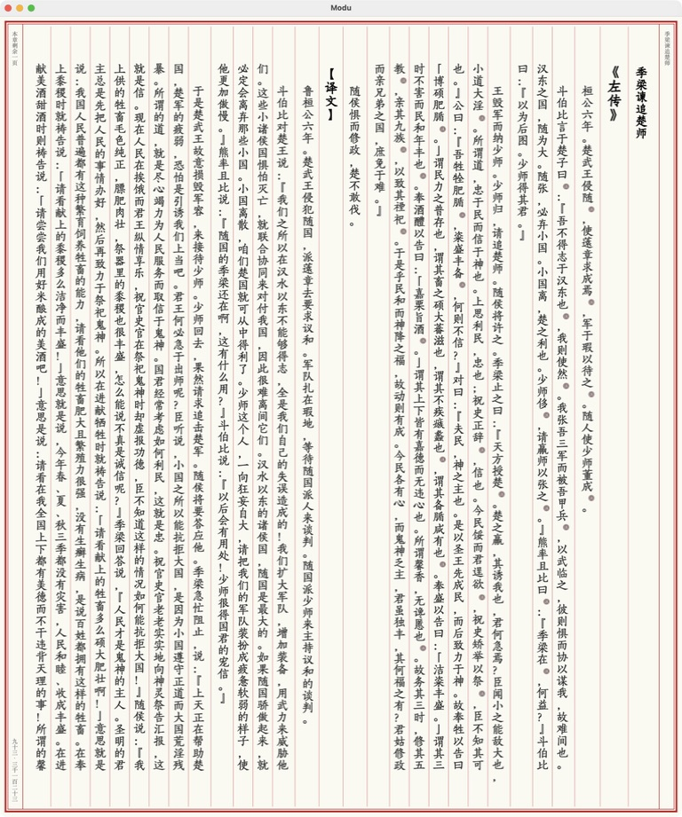

# Modu Reader · 默读

[简体中文](README.md) | [English](README_EN.md)

Only these Chinese and English project homepages are maintained.

<p align="center"></p>


Modu is an open-source AI ebook reader built with Flutter. It brings books, notes, reading progress and AI conversations together: read first, then ask questions about the current chapter. For semantic search, index your books using local models or a remote embedding service.

**Local reading does not require an AI account.** AI, online translation and online speech are optional; availability and costs depend on your chosen providers. See [Releases](https://github.com/sobranie2406/modureader/releases) for version updates and usage notes.

Modu has no in-app unlock purchases or subscriptions. Fees charged by online service providers are separate from Modu.

If Modu helps you enjoy reading, please give the repository a **Star ⭐** in the top-right corner. It helps more readers discover the project and encourages continued development. Thank you!

[Features](#features) · [Screenshots](#screenshots) · [Getting started](#getting-started) · [Settings guide (Chinese)](docs/SETTINGS.md) · [Downloads](#downloads)

**Latest release: 1.1.6** — paragraph-based online narration, visual CSS presets, built-in selection search, clearer note exports and selectable update sources.

## Downloads

[GitHub Releases](https://github.com/sobranie2406/modureader/releases) · [Gitee package mirror](https://gitee.com/sobranie2406/modureader/releases) · [Build status](https://github.com/sobranie2406/modureader/actions) · [Report an issue](https://github.com/sobranie2406/modureader/issues)

Modu checks for updates at launch. Settings → About Modu → App updates offers separate GitHub/Gitee source selectors for checking and downloading, defaulting to GitHub. Failed GitHub requests fall back to Gitee while size and SHA-256 verification remain mandatory. macOS downloads open in your browser. Gitee hosts packages, documentation and update metadata; old releases are replaced by the newest release, with links to the corresponding GitHub source.

| Platform | Published architectures | Installation |
| --- | --- | --- |
| Windows | x64, ARM64 | EXE installer with shortcuts and an uninstaller; no commercial code signature; requires WebView2 Runtime |
| Linux | x64, ARM64 | DEB for Debian 13 (trixie); install with APT to resolve system dependencies |
| Android | x86_64, arm64-v8a | APK signed with the project's dedicated key; verify the download source before installing |
| macOS | x64, ARM64 | DMG; drag the app to Applications; unnotarized, not an App Store release |
| iOS | ARM64 devices | iOS 16+; IPA has no Apple distribution signature and cannot be installed directly; you must sign it yourself using a valid signing identity |

Here, x64 means x86-64; ARM64 is also 64-bit. There is no x64 iPhone/iPad device package.
Download the installer and its SHA-256 file from [Releases](https://github.com/sobranie2406/modureader/releases), choosing your system and architecture.

Desktop apps use native installers. Download the installer for your platform, not GitHub's automatically generated source archive. Licenses are included in each package. See [Release and installation instructions (Chinese)](docs/RELEASING.md).

## Features

The current version provides the following reading, AI and library features.

| Area | What it does | Where to find it |
| --- | --- | --- |
| Library and import | Import EPUB, PDF, MOBI, AZW3, FB2 and TXT; filter by reading status, search, group books and manage tags | Home → Library; add button or book menu |
| Remote library | Browse a separate WebDAV server; sort by name, creation/modification time or size in either direction, search, filter by format and download books | Home → Remote library; Settings → Remote library settings |
| Reading and layout | Chapter navigation, adjacent chapter preloading and paginated/scrolling modes; continuous chapter scrolling for horizontal reflowable books with book scripts disabled; adaptive footnotes at 80% of the reader font size with end padding; rule-based TXT-to-EPUB conversion | Reader; Settings → Reading |
| Selection search | Baidu, Bing, Google, Baidu Baike, Wikipedia and custom engines in a built-in browser | Settings → Selection search; text selection menu |
| In-book search | Floating search dialog, selection-style text highlights, previous/next match and current/total counter; return to the original position or close search at the current position | Reader toolbar, between Translation and Bookmarks |
| Highlights and notes | Highlight text, record thoughts and organize notes by chapter; copy or export Markdown, TXT and CSV | Text selection menu; Home → Notes |
| Mobile quick mark | Swipe directly across text and release to save a highlight; select across lines, backwards or across paragraphs on the same page | Pen button in the mobile reader; persistent Exit button restores normal gestures |
| Local dictionaries | Import, name, enable/disable and delete MDX / StarDict dictionaries; look up selected text offline; no dictionaries bundled | Settings → Custom dictionaries; text selection menu |
| Reading statistics | Reading time, trends, heatmap and per-book records | Home → Statistics |
| AI conversations | Home quick prompts, in-book questions and chat history; enabled tools access the library, contents, chapters, notes and reading records | Home → AI; reader AI panel |
| AI reading skills | Ten built-in skills with Chinese names; enable/disable, inspect/edit prompts and create custom skills; keep skill shortcuts in chat while showing skill names instead of long prompt messages | AI input area; Settings → AI Reading Skills |
| Semantic search and RAG | Combined keyword and vector search, locally stored indexes, background indexing queue and reindexing | Book menu; Settings → Embedding Models |
| Translation | Free Google translation, AI translation and DeepL/DeepLX; selected-text results use the same popup sizing as AI chat, with scrolling for long output | Settings → Translation; top reader toolbar, next to AI |
| Read aloud | System speech, Edge TTS, Xiaomi MiMo and compatible online services; voice selection, previews and speech parameters | Settings → Read Aloud; reader playback controls |
| Sync and backup | WebDAV sync for books, notes and reading progress; local backups; separately enabled encrypted API-key sync | Settings → Sync |
| Configuration transfer | All global settings via files, QR images and modu links, with an independent credentials switch | Settings → Advanced → Global settings backup |
| Appearance and tools | System/dark/light themes, cover display, automatic application of imported fonts, font downloads, app brightness control (auto on the left, slider in the middle, night mode on the right), network and logging options | Reader brightness button; Settings → Appearance / Reading / Advanced |
| Bug reporting | Describe a problem and reproduction steps, preview the report, then submit it on GitHub | Settings → Report a Bug |

### Vertical layout and storage

Vertical reading offers optional red frames and column rules, with titles on the right and page information on the left. Chinese locales use Chinese numerals. Footnotes use 80% of actual paragraph text size, not the reference marker; popups occupy at most 25% of screen area, with horizontal scrolling for long vertical notes.

Android library data migrates to `Android/data/com.modu.reader/files` with verification before opening the library. The old private copy is retained and conflicts stop migration rather than overwrite data. Credentials and preferences remain private. Back up first and upgrade in place without uninstalling or clearing data. OS restrictions still apply to Android/data; this location is not a backup. See the [migration notes (Chinese)](docs/testing/android-app-storage.md).

Downloaded embedding models can be deleted in settings unless protected by an active task. Large local indexes use streaming reads with a 1 GiB file limit; practical capacity still depends on available RAM.

### Separate Chinese and English fonts

Reader styles offer separate Chinese/body and English (letters/numbers) fonts. English follows the body font by default; an independent face covers Latin letters, digits and western punctuation while Chinese text and punctuation retain the body face. This works in reflowable horizontal/vertical text and footnotes. Importing TTF/OTF from the English selector applies it only to English. Fixed-layout books such as PDFs are not re-typeset.

### Custom CSS profiles

Manage 32 named profiles in Settings → CSS settings, with 13 editable presets and visual controls for colors, fonts, spacing, paragraph layout and underlines. Custom CSS and regex highlights remain available, along with independent switches, combined activation and file import/export. Reader controls apply profiles; detailed editing stays in Settings. Existing slots and per-book choices are preserved. See [CSS presets (Chinese)](docs/CSS_PRESETS.md).

### Notes export

Original passages are labeled `原文：【…】`. Markdown additionally highlights note content, and exports include the creation or last-edit time.

### WebDAV remote library

Enter the full book-directory URL, username and password in Settings → Remote library settings, test the connection and save. Open Home → Remote library to browse. Tap folders to navigate, or use Parent folder and Root to go back. A book's download button downloads and imports it into your local library for offline reading. Downloads show progress, support cancellation and check for duplicates. The limit is 512 MiB per file, with one download at a time; leaving the tab cancels an unfinished download.

This connection is separate from WebDAV sync. It only reads and downloads files; it never uploads or deletes server files. Anonymous and username/password access are supported. Prefer HTTPS and a dedicated read-only account. The URL, username and password persist in local app preferences without additional local encryption. Enabling **Sync API keys** includes the library connection in automatic WebDAV sync with AES-256-GCM encryption; devices need the same sync encryption password. Global settings backup can explicitly include account credentials; this export is unencrypted and excludes credentials by default. Clearing the connection propagates to other opted-in devices and removes its saved password, not books or server files.

Use Settings → Advanced → Global settings backup to transfer all preferences through files, modu links or QR images. A separate switch includes accounts, passwords and API configurations and is off by default; when off, import also preserves existing local credentials. Explicit exports containing credentials are unencrypted: keep them private. Import validates before restoring and does not automatically connect to servers.

After saving a settings file or QR image, a confirmation shows its full location with a copy action. Windows saves to the current user's Downloads folder; other platforms use the location selected in the save dialog.

### Mobile page-turn controls

In scrolling mode, page-turn taps and shortcuts move by 80% of the reading viewport, leaving 20% overlap for text near the screen edges. Free scrolling is unchanged. Desktop arrow keys turn pages when the reader is focused; in the AI input field they move the text cursor.

Reader styles → More settings → Other includes **Tap-only page turning**, off by default. When enabled in paginated mode, swipes and drags neither turn pages nor trigger pull gestures; taps still work. Turn it off to restore swipe navigation. Text selection, Quick mark and scrolling mode remain available. This mobile-only switch is not shown on desktop.

### Quick marking on mobile

The top-right menu toggle controls whether saving a quick highlight immediately opens the selection menu. It is off by default and remembered on this device.

Adjacent same-color highlights without comments can merge across pages within one chapter document. Missing text, intervening images or existing comments keep marks separate.

Open a reflowable ebook and tap the pen button in the reader toolbar to enable Quick mark. No long press is needed: swipe from the beginning of the text you want to capture, then release to save the highlight. It uses your current highlight color and appears in the existing notes list. Marking the same location again preserves any existing comment.

While enabled, swiping over text selects it. Tap text to open the reading controls, or use the persistent Quick mark · Exit button to restore normal page turns and scrolling. The mode starts off each time you enter a book and is not shown on desktop. PDF, scanned images and fixed-layout books are not supported; selection does not automatically continue across pages.

### AI grounded in your reading

Reasoning effort is configurable per model, including **Off** for supported models. Full-text translation uses the selected model's parameters. Actual support depends on the provider and model.

Home AI is intended for library, note and reading-history questions. In-book AI focuses on the current book, chapter or selected text. Home offers quick prompts, while the reader uses enabled reading skills. Their contexts are different: a home-screen question should not automatically be treated as referring to a current chapter.

Add or edit models under Settings → AI Settings → Provider Configuration. Each model can have its own endpoint, model name, API key, temperature, maximum output tokens and number of conversation-history turns. OpenAI-compatible, Claude and Gemini protocols are supported. Presets include OpenAI, Claude, Gemini, DeepSeek, Zhipu GLM and OpenRouter; compatible custom endpoints can also be configured. Model discovery, tool calling and parameter ranges depend on the provider.

Built-in provider details support restoring defaults: endpoint and parameters reset, saved keys are cleared, and the default enabled state is restored after confirmation. Custom providers can be deleted by swiping the list or from their detail page.

Enable AI tools as needed, including finding books and notes, searching text, reading chapters, inspecting reading records and generating mind maps. AI output can be wrong. Book summaries are limited by the text retrieved, search results and the model's context window; one request is not guaranteed to read an arbitrarily long book in full.

### Ten built-in reading skills

Quick skills in AI chat are collapsed by default; expand them with the skill button beside the input. AI body text has its own font-size setting. Mind maps can be exported as PNG, SVG, Markdown, FreeMind (`.mm`) or JSON.

The built-in names are displayed in Chinese; their English meanings are provided below.

| Skill | Purpose |
| --- | --- |
| 本章总结 — Chapter Summary | Outline the current chapter's content, plot and themes |
| 全书总结 — Book Summary | Summarize available book content and structure |
| 概念解析 — Concept Explainer | Explain concepts, terminology and abstract ideas |
| 论证分析 — Argument Analyzer | Break down claims, reasoning and supporting evidence |
| 人物追踪 — Character Tracker | Track character relationships and development |
| 金句摘录 — Quote Collector | Extract noteworthy passages from the original text |
| 阅读指南 — Reading Guide | Suggest reading approaches, discussion questions and reflection topics |
| 智能翻译 — Smart Translator | Translate content in its book context |
| 词汇助手 — Vocabulary Helper | Explain unfamiliar words, idioms and technical expressions |
| 思维导图 — Mind Map | Organize content into a hierarchy |

Open a skill to inspect its prompt, edit and save it, or restore the default. Custom skills appear alongside built-in skills in the reader AI panel. Prompts for recalling previous content, translation/dictionary and full-text translation are managed on the same settings page.

### Book indexing and local models

AI text search reuses the same keyword/vector hybrid retrieval. Reading skills retain their chapter, selection or reading scope. Vector indexes stay on each device and are not uploaded or downloaded through WebDAV. Build indexes on each device as needed; existing local indexes are preserved. See the [local index and reading controls guide (Chinese)](docs/INDEX_SYNC_AND_READING_CONTROLS.md).

Choose **Index** or **Reindex** from a book's pop-up menu. Books enter a background queue, so you can leave the indexing screen. Check task status and error messages to confirm completion. For automatic indexing of new imports, enable both the embedding model and **Automatically index after import** in Settings → Embedding Models. Automatic indexing is off by default.

| Local ONNX model | Languages | Embedding dimensions |
| --- | --- | --- |
| all-MiniLM-L6-v2 | English | 384 |
| BGE Small EN v1.5 | English | 384 |
| BGE Small ZH v1.5 | Chinese | 512 |
| Multilingual E5 Small | Multilingual | 384 |

All four models and tokenizers are **downloaded on demand, not bundled in installers**. In Settings → Embedding Models → Model download source, choose [Gitee mirror](https://gitee.com/sobranie2406/modu-models/releases/tag/models-v1) or Hugging Face (default), then select Download and use. If the mirror is unavailable, switch to Hugging Face manually; the app never switches sources silently. Downloads are verified by size and SHA-256 and then work offline without API keys. Existing verified models are reused; startup and indexing never download missing models automatically. Chinese BGE is selected by default and automatic indexing is off. Remote embedding APIs remain optional. Reindex books after switching models; chat and embedding settings are separate.

Local embedding computation stays on your device. Remote chat, embedding, translation and speech services receive the text needed for their tasks.

### Translation and read-aloud

Mobile inline images fit the reading area proportionally. Footnote popups resize to content, capped at 25% of the visible reader viewport area; longer notes scroll inside the popup.

At a chapter boundary, narration automatically continues with the next chapter's heading and body, skipping empty chapters.

Full-text translation stop controls stay in the toolbar without covering the text. Translate selected text or use the translation button next to AI in the top reader toolbar, with Google translation, AI translation or DeepL/DeepLX. Selected-text results use consistent body text and capped heading sizes; long translations scroll inside a popup sized like AI chat.

Online narration groups adjacent sentences within a natural paragraph for Edge, MiMo, OpenAI-compatible and DashScope services. Each playback group has accurate highlighting and previous/next group navigation. System speech retains sentence navigation; select text and choose Read aloud to start there. The first group is prioritized and later groups are continuously prefetched during playback to reduce pauses between paragraphs. MiMo playback speed follows the reader slider. MiMo and supported compatible services use voice/style descriptions and stable narration guidance; OpenAI-compatible settings offer editable instructions and presets. Actual synthesis or playback errors retain the position for retry.

### Sync and key security

Optional timed sync runs only while reading in the foreground, at 1, 2, 3, 5, 10, 15 or 30 minutes, or one hour. It respects automatic-sync and Wi-Fi settings and shows only terminal success/failure feedback.

- WebDAV syncs your library, notes and reading progress in the `modu` folder under the configured endpoint, without a Modu cloud account. See the relevant Release notes for legacy-folder migration.
- Books, notes, bookmarks and reading positions merge record by record. The latest reading action wins, rather than the furthest progress; new reading-time records are deduplicated and deletions retain markers. Stale reader writes are rejected after sync, and note conflicts retain the draft. Fonts, theme images, local dictionaries and vector indexes are not synced. Reliable ETag servers use conditional writes; other servers use verified immutable record batches. See the [sync guide (Chinese)](docs/WEBDAV_RECORD_SYNC.md) for migration and server requirements.
- **Sync API Keys** is off by default and separate from the main WebDAV switch. Enabling it requires a separate password and acknowledgment of the risks.
- Sensitive service settings are encrypted with **AES-256-GCM** before being written to the sync database. Other devices need the same password. The password is not synced and cannot be recovered if lost.
- This does not encrypt all books, notes or the entire backup, and does not replace a trustworthy WebDAV service and a strong password.
- **Configuration codes and QR codes are not encrypted** and may contain passwords or API keys. Do not post them in public screenshots, issues or group chats. Configuration transfer is separate from encrypted key sync.

## Screenshots

Screenshots below are from **Modu 1.1.1 (10033) on macOS**. Horizontal reading shows the original demo EPUB; vertical reading shows a local edition of *Guwen Guanzhi*. Only the interface is shown; the book is not distributed.

### Reading: text, fonts and themes

The original demo book *Reading: Let Your Thinking Slow Down* (《阅读，让思考慢下来》) is shown in the EPUB reader with a single-column layout, Chinese font, light theme and progress information. Font size, line spacing and columns can be adjusted in reading settings.


### Classical vertical reading: red frame and column rules

The actual *Guwen Guanzhi* reading view shows the optional red frame and rules between text columns. Chapter information appears on the right, reading progress on the left, with Chinese numerals in the Chinese interface.



### In-book AI: read and ask side by side

The AI sidebar keeps the book text visible. Open the sparkle button to choose chapter summary, concept explanation and other reading skills, or type your own question.


### Home AI: start with a quick question

Home offers twelve quick questions about your library and reading records, covering recent reading, notes, unread books, reading time and library organization. The input area also provides general explanation, summary and analysis prompts.


The screenshots show reading and AI controls. [Download the original demo EPUB](docs/examples/modu-reading-demo.epub) to try them yourself.

<details>
<summary>More screenshots: chapter navigation, AI skills and local embedding models</summary>

### Contents and bookmarks


### AI reading skills and prompt management


### Local embedding models: on-demand downloads and management

Embedding models are not bundled in the installer. Choose Hugging Face or Gitee as the download source, then download, switch or delete models as needed.


</details>

## Getting started

1. Download the package for your system and architecture from [Releases](https://github.com/sobranie2406/modureader/releases). Follow the installation instructions.
2. Add an ebook to the library and open it. No API key is required if you do not use AI.
3. To use AI, configure a model in Settings → AI Settings and test the connection.
4. For semantic search, download a local model in Settings → Embedding Models (Chinese BGE is the default), then index a downloaded book from its menu. You can also configure a remote embedding endpoint.
5. Choose translation, read-aloud and sync services as needed. See the [Settings guide (Chinese)](docs/SETTINGS.md) for instructions, parameter explanations and security considerations.

## Feedback

See [Releases](https://github.com/sobranie2406/modureader/releases) for version changes and downloads.

When reporting an issue in [this repository](https://github.com/sobranie2406/modureader/issues), include your version, system, architecture, reproduction steps and a sample without private information. Never submit API keys, WebDAV passwords or configuration QR codes.

## Build from source

The pinned Flutter version is recorded in [.github/flutter-version](.github/flutter-version); dependencies are locked in pubspec.lock. You need Flutter's native toolchain for your platform. Building the tokenizer from source also requires Rust, including the appropriate mobile targets.

```sh
flutter pub get
flutter gen-l10n
dart run build_runner build --delete-conflicting-outputs
flutter test --concurrency 1
# Run on the appropriate host platform:
flutter build macos --release --build-name "$(python3 scripts/release/verify_mobile.py --apple-build-name)"
# Configure Android release signing as described in docs/RELEASING.md first.
flutter build apk --release --target-platform android-arm64,android-x64 --split-per-abi
```

See [.github/workflows/build.yaml](.github/workflows/build.yaml) and scripts/release for the complete build and packaging procedure. The Dart package name remains `anx_reader` for compatibility with existing imports. The user-facing brand and application ID are Modu / `com.modu.reader`.

## Star history

Thank you to everyone supporting Modu. Click the chart to explore its growth on [Star History](https://www.star-history.com/?repos=sobranie2406%2Fmodureader&type=date&legend=top-left).

<a href="https://www.star-history.com/?repos=sobranie2406%2Fmodureader&amp;type=date&amp;legend=top-left">
  <picture>
    <source media="(prefers-color-scheme: dark)" srcset="https://api.star-history.com/chart?repos=sobranie2406%2Fmodureader&amp;type=date&amp;theme=dark&amp;legend=top-left" />
    <source media="(prefers-color-scheme: light)" srcset="https://api.star-history.com/chart?repos=sobranie2406%2Fmodureader&amp;type=date&amp;legend=top-left" />
    
  </picture>
</a>

## License and origins

The project is distributed under **GPL-3.0-or-later**; see [LICENSE](LICENSE).
Anx Reader's MIT copyright and license are preserved in [LICENSES/Anx-Reader-MIT.txt](LICENSES/Anx-Reader-MIT.txt).
ReadAny's copyright and license are preserved in [LICENSES/ReadAny-GPL-3.0-or-later.txt](LICENSES/ReadAny-GPL-3.0-or-later.txt).
See [UPSTREAM.md](UPSTREAM.md) and [NOTICE](NOTICE) for pinned upstream revisions, modification scope and third-party attribution. When distributing binaries, retain the licenses, identify your modifications and provide the complete corresponding source and build scripts for that version.

[Privacy (Chinese)](PRIVACY.md) · [Security](SECURITY.md) · [Contributing](CONTRIBUTING.md)
