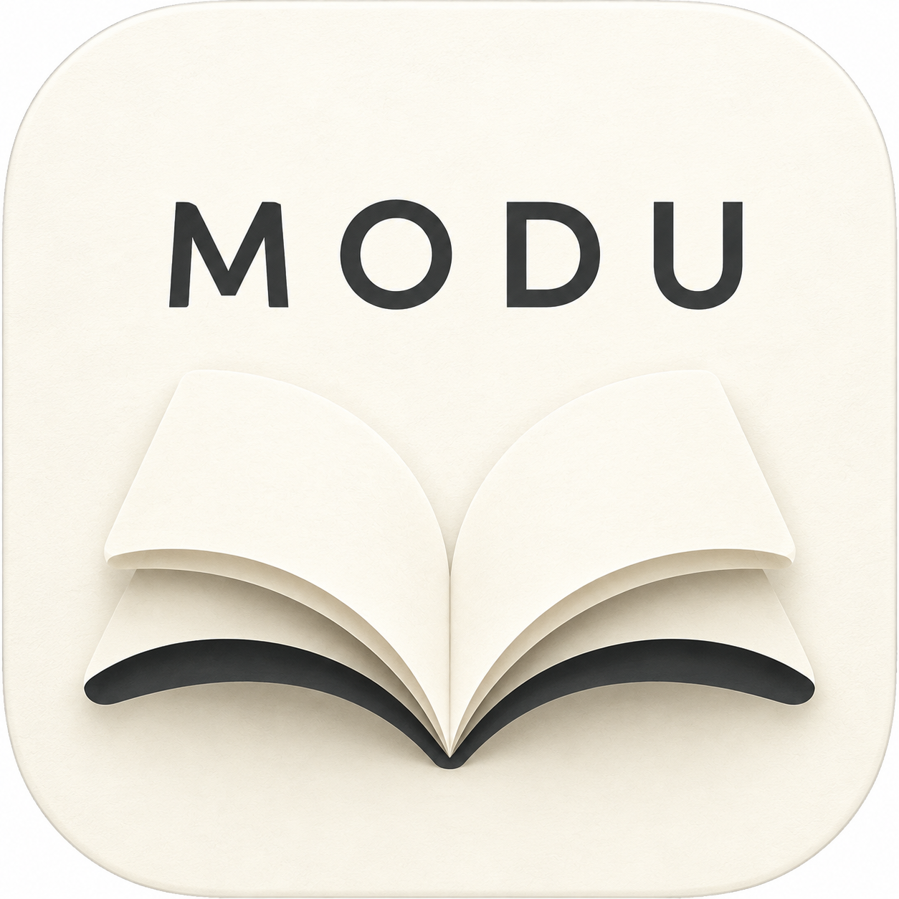
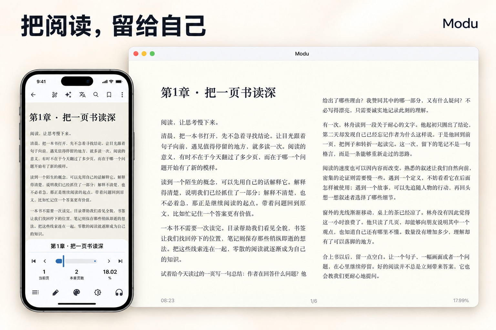
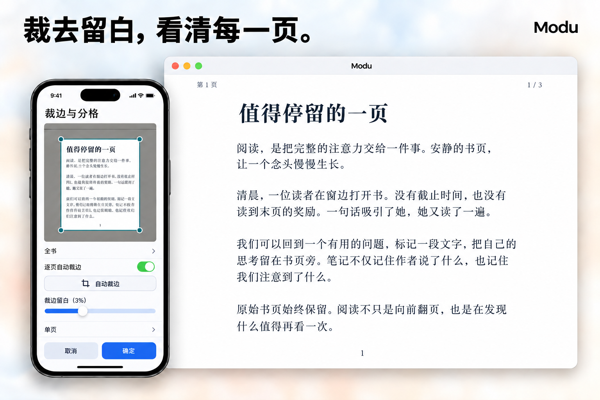
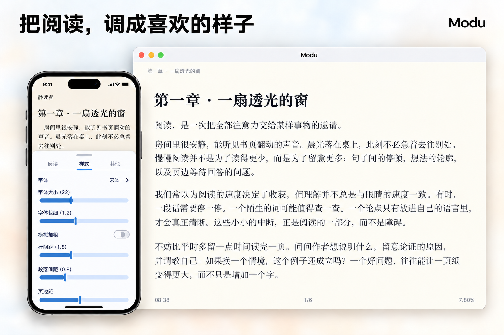
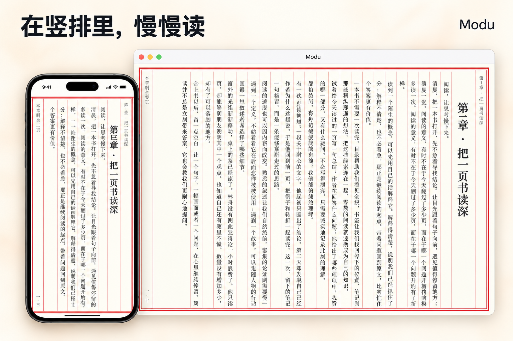
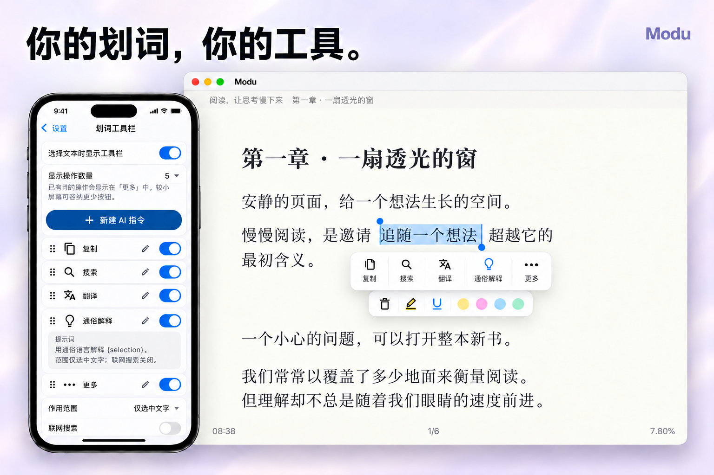
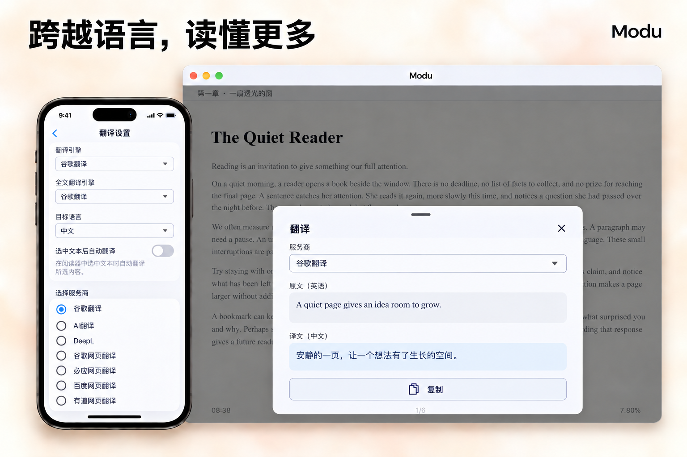
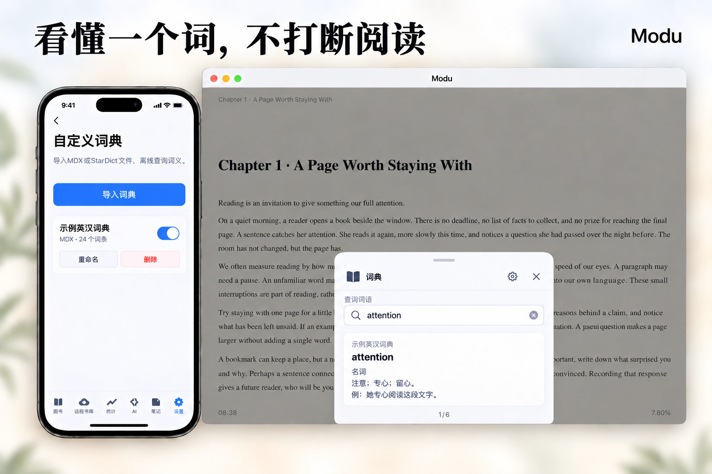
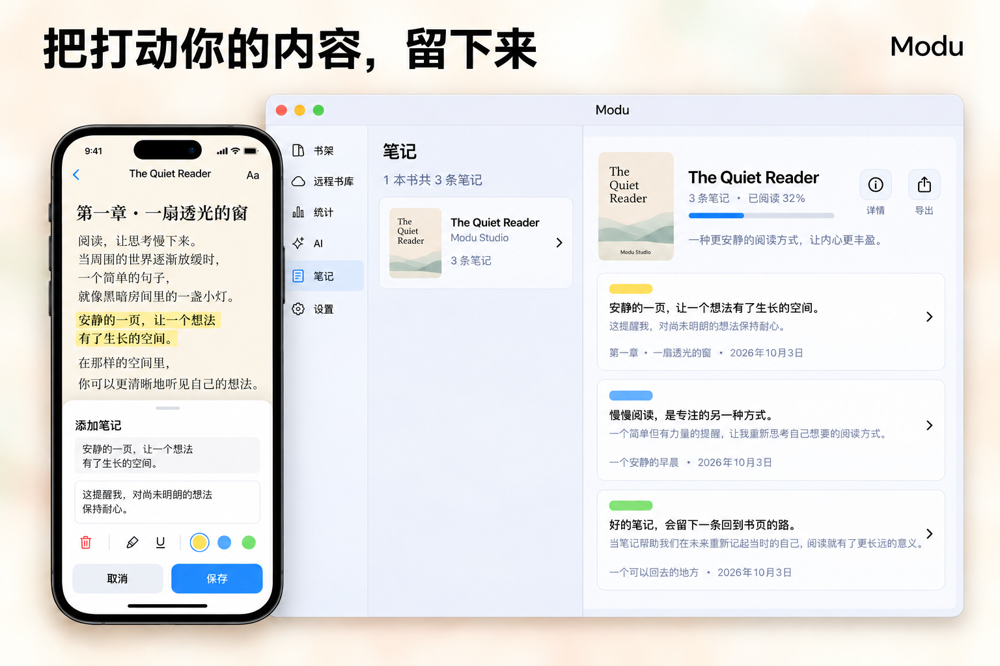
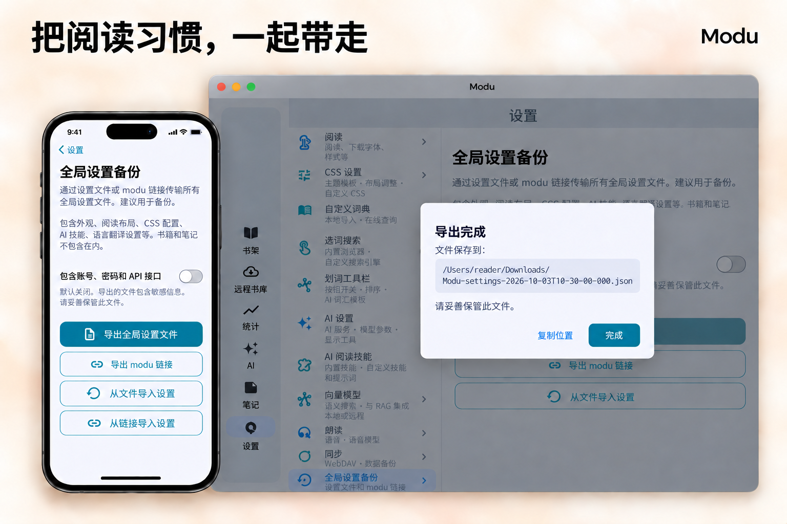

<p align="center">
  
</p>
<h1 align="center">默读 · Modu Reader</h1>
<p align="center">
  <a href="README_zh.md">简体中文</a> · <a href="README.md">English</a>
</p>
<p align="center">默读是基于 Flutter 的开源跨平台阅读器，支持电子书、PDF 与扫描图片书籍。裁边增强、设备端 OCR、全文翻译、听书与 AI 阅读，让不同格式的书籍更易阅读；笔记、阅读进度与 WebDAV 同步相连，也可按需建立本地或远程向量索引。</p>

<p align="center">
  <a href="https://github.com/sobranie2406/modureader/releases/latest"></a>
  <a href="LICENSE"></a>
  <a href="#downloads"></a>
</p>
<p align="center">
  <a href="https://github.com/sobranie2406/modureader/releases/latest"><b>下载最新版</b></a> ·
  <a href="https://gitee.com/sobranie2406/modureader/releases">Gitee 镜像</a> ·
  <a href="#features">功能一览</a> ·
  <a href="docs/SETTINGS_zh.md">设置指南</a> ·
  <a href="docs/README.md">文档目录</a> ·
  <a href="https://t.me/Modureader">Telegram 频道</a> ·
  <a href="https://t.me/ModuReaderDiscussion">Telegram 讨论群</a> ·
  <a href="https://github.com/sobranie2406/modureader/issues">问题反馈</a>
</p>

## 交流与反馈

欢迎关注 Modu 默读频道，并加入 Telegram 讨论群或 QQ 交流群：

| 交流入口 | 内容与用途 | 地址／群号 |
| --- | --- | --- |
| **Modu 默读 · Telegram 频道** | 新版本发布、更新说明与项目动态 | [https://t.me/Modureader](https://t.me/Modureader) |
| **Modu 默读 · Telegram 讨论群** | 阅读交流、使用答疑、问题反馈与功能建议 | [https://t.me/ModuReaderDiscussion](https://t.me/ModuReaderDiscussion) |
| **Modu 默读 · QQ 交流群** | 中文阅读交流、使用答疑与问题反馈 | **1009765685** — 在 QQ 搜索群号申请加入 |

问题与功能建议优先通过 [GitHub Issues](https://github.com/sobranie2406/modureader/issues/new/choose) 提交；不方便使用 GitHub 时，可填写[在线反馈表](https://docs.qq.com/smartsheet/form/dxaiuhjrhCar%2Ft00i2h%2FvI8Bvs?tab=t00i2h)。每条反馈只描述一个问题或建议，并提供默读版本、系统与设备、复现步骤和预期结果。请勿提交密钥、密码、私人书籍或未脱敏日志。



> **本地阅读不需要 AI 账号。** AI、在线翻译和在线语音按需配置，费用与可用性取决于所选服务。各版本更新与使用说明见 [Releases](https://github.com/sobranie2406/modureader/releases)。

默读不提供内购解锁或订阅；在线服务商自行收取的费用不属于默读内购。

<a id="downloads"></a>

## 下载

| 平台      | 已发布架构             | 安装方式                                           |
| ------- | ----------------- | ---------------------------------------------- |
| Windows | x64、ARM64         | EXE 安装器；支持快捷方式和卸载，未做商业代码签名，需要 WebView2 Runtime |
| Linux   | x64、ARM64         | DEB；面向 Debian 13 (trixie)，使用 APT 安装并解析系统依赖     |
| Android | arm64-v8a         | 项目专用密钥签名的 APK；首次安装请核验下载来源                      |
| macOS   | x64、ARM64         | DMG；打开后拖入 Applications，未公证，非 App Store 版本      |
| iOS     | ARM64 真机          | iOS 16+，IPA；无 Apple 分发签名，不能直接安装，需要自行合法签名       |
| 原生鸿蒙 | ARM64 | 未签名 HAP，安装前需使用鸿蒙证书及 Profile 手动签名；尚未完成实机验证，不是安卓 APK。 |

<details>
<summary>安装、更新与版本说明</summary>

**最新版本：1.2.2** — 支持文件夹与多本书籍导入，改善 OCR／重排文字划词，完善 E‑Ink 动画关闭，加入书架格式与扫描版标签、半透明浮动导航栏及 Telegram／QQ 社区入口。

同时加入与现有 WebDAV 独立配置的 S3 兼容对象存储同步、划线内脚注修复、安卓动画与键盘布局优化，以及鸿蒙未签名包。鸿蒙需要手动签名安装，现有自动更新流程不能用于 HAP 签名或安装。

应用每次启动检查更新，也可在「设置 → 关于默读 → 版本检查与更新」选择 GitHub 或 Gitee，检查、下载、取消并打开安装器。默认优先 GitHub，连接失败时自动尝试 Gitee；手动选择 Gitee 则直接使用镜像。两站提供相同安装包及 SHA-256，应用内下载安装前再次校验。macOS 使用浏览器下载 DMG。Gitee 保留最新版，GitHub 提供历史版本及完整源码。

检查与下载共用一个来源选择，切换来源后重新检查即可。语言可在「设置 → 外观」手动选择或跟随系统，内置 AI 提示词随应用语言切换；用户自行编辑的提示词保持原文。

这里的 x64 指 x86-64，ARM64 也是 64 位。iPhone/iPad 没有 x64 真机包。
安装包及 SHA-256 校验文件见 [Releases](https://github.com/sobranie2406/modureader/releases)，请按系统与架构选择。

桌面端提供原生安装包，GitHub 的 `Source code (zip)` 用于获取源码。签名、依赖和安装步骤见 [安装指南](docs/RELEASING.md)。

</details>

<a id="features"></a>

## 功能一览

从整理书库，到沉浸阅读、随手记录，再到用 AI 深入理解——把常用工具放在阅读身边。

| 功能模块 | 可以做什么 |
| --- | --- |
| [书库管理](#library) | 多格式导入、文件夹整理、批量移动、置顶与远程书库 |
| [阅读与排版](#reading) | 字体、粗细、间距、页边距、横排与竖排 |
| [PDF 与扫描书](#scanned-books) | 原页裁边、分格顺序、窗口适配与图像增强 |
| [本地 OCR 识别](#ocr) | 按需下载轻量模型，识别重排、划词与提取到 AI |
| [CSS 自定义](#css) | 图形调节、正则高亮、自定义代码、多套方案与导入导出 |
| [听书与声音](#listening) | 多引擎朗读、音色与风格提示词、最高 4 倍速 |
| [AI 阅读](#ai) | 章节问答、阅读技能、自定义提示词、多轮追问 |
| [划词工具栏](#selection) | 按钮开关、拖动排序、选文范围与自定义 AI 命令 |
| [全文翻译与搜索](#translation) | 正文双语对照、仅译文模式、划词翻译与网页搜索 |
| [离线词典](#dictionary) | 导入本地词典，在书页旁查看选中词语的释义 |
| [笔记与高亮](#notes) | 标注原文、记录想法、导出笔记、链接返回书中位置 |
| [阅读统计](#statistics) | 阅读时长、趋势、热力图与单本书阅读记录 |
| [向量化与知识检索](#vector) | 本地模型、远程嵌入接口、后台索引与语义检索 |
| [同步与数据库备份](#data) | WebDAV 同步、书库 ZIP 备份与恢复 |
| [全局设置备份与导出](#backup) | 文件与链接迁移设置，账号密钥独立控制 |

展示使用原创示例内容，不包含个人书库。可下载 [《阅读，让思考慢下来》](docs/examples/modu-reading-demo.epub) 体验。完整参数与入口见[设置指南](docs/SETTINGS_zh.md)。

<a id="scanned-books"></a>

## 保留原版，也让扫描书更好读

保留原书的图文版式，同时让书页适应眼前的屏幕。PDF 与已识别为扫描版的图片书使用专用阅读菜单，不再套用普通文字书的字体、行距控件。

- **去掉多余留白：**自动裁边逐页识别内容边界，可调保护留白，也可手动拖动裁边框。
- **按合适顺序阅读：**分格并设置阅读顺序，旋转页面，选择单页或连续卷轴。
- **把细节看清楚：**适应屏幕、适应屏宽、缩放，配合文字加黑、对比度、加黑、漂白和锐化。
- **随时对照原图：**预览图像增强效果，可选扫描水印减淡；裁边和增强不改写原书文件。



EPUB、MOBI、AZW3、FB2 在导入时识别图片书，打开时不重复检测，也可通过书架菜单手动切换。普通文字书继续使用原有阅读菜单与样式。

<details>
<summary>图像处理与墨水屏说明</summary>

自动裁边可应用于全书，每一页分别识别边界。建议保留少量留白，保护页码、脚注和文字边缘。扫描水印减淡属于图像处理，不能保证还原被水印遮挡的文字，请对照原图确认。

菜单颜色跟随软件主题；只有开启 E-INK 模式才显示专用刷新控件，硬件刷新效果取决于设备支持。普通文字书保持原有阅读菜单与样式，不受扫描版设置影响。

</details>

<a id="ocr"></a>

## 让扫描书，也能划词阅读

不止于放大一张图片。识别出的文字**直接进入阅读界面**，可以调节排版、划词、标注、记笔记，也可以继续使用 AI 阅读工具。


1. 在**「设置 → OCR 模型」**选择模型和下载源，推荐先使用 **PP-OCRv4 中英文版**。
2. 打开 PDF／扫描书菜单：**文字重排**利用已有文字层，**OCR 重排**识别页面图片。按当前整页或裁边后的区域重排，无需再次选择范围。
3. 在重排正文中选词，进行复制、翻译、标注或 AI 提问；齿轮入口调节识别文字的样式，不改变原图和其他书籍。
4. 只需要某段内容时，使用**「提取」**选择区域，将文字送入 **AI 输入框草稿**，检查、编辑后再发送。

<details>
<summary>轻量模型、离线使用与识别限制</summary>

| 模型 | 下载体积 | 适用方向 |
| --- | --- | --- |
| PP-OCRv4 中英文 | 约 14.9 MiB | 推荐的通用选择 |
| PP-OCRv5 中英文 | 约 20.5 MiB | 轻量新版 |
| PP-OCRv3 中英文 | 约 12.5 MiB | 更小的备选模型 |
| PP-OCRv3 英文 | 约 10.9 MiB | 英文轻量识别 |

模型按需下载，不内置在安装包中。可选上游或 Gitee 镜像，下载后检查大小与 SHA-256；模型卡片提供删除选项，释放空间时不删除书籍或已识别文字。

下载后在本机离线识别，无需 API Key；将提取文字发送给在线 AI 是另一个独立操作。识别效果受清晰度、语言和版式影响，姓名、数字和复杂分栏应对照原图核验。OCR 不会自动向量化整本书，也不会改写原始 PDF。

</details>

<a id="library"></a>

## 让每本书，都有位置

支持 EPUB、PDF、MOBI、AZW3、FB2、TXT 和 Markdown。按阅读状态筛选，用文件夹整理书籍，把常读的书或文件夹置顶。

- 批量选择书籍，新建文件夹，或移入已有文件夹。
- 搜索、排序 WebDAV 远程书库，按需下载后离线阅读。
- 在高级设置中导入 ANX Reader 的 ZIP 备份，迁移已有书库。


<details>
<summary>远程书库与迁移说明</summary>

远程书库与同步分别配置，只读取和下载，不上传或删除服务器文件。入口为「设置 → 远程书库设置」，支持匿名访问和用户名/密码认证，推荐 HTTPS 与只读账号。单文件上限 512 MiB，一次下载一本，并进行重复检查。

ANX 备份导入会校验并合并支持的数据，保留已有默读记录，并在导入前创建数据库快照。导入前请阅读页面上的兼容范围和操作说明。

</details>

<a id="reading"></a>

## 把阅读，调成喜欢的样子

调整字体、字体粗细、行距、段距和页边距，中英文可以使用不同字体。翻页或滚动、浅色或深色，都由自己的阅读习惯决定。

- 点击正文即可调出章节与翻页控制，拖动进度条时预览章节标题。
- 支持背景、主题、OLED 与墨水屏模式，应用语言可手动选择或跟随系统。
- 长按自动选词或整段，随后用手柄自由调整范围。
- 样式中的图形调节与 CSS 方案搭配使用，阅读界面直接应用。



### 竖排，也有书页的秩序

适合的书籍可以切换竖排，搭配边框与栏线，保留传统书页的阅读节奏。



<details>
<summary>字体与阅读细节</summary>

字体粗细为 0.5–2.0，步进 0.1；固定字重字体可开启「模拟加粗」，在大于 1.0 时增加笔画厚度，但不能把固定粗体变细。PDF 等固定版式不会重新排版。

滚动翻页步幅支持 80%–100%。正文注释在阅读器中弹出；页眉页脚可分别显示章节序号与本章当前页/总页数。内置 AI 提示词跟随应用语言，自行编辑的提示词保持原文。

</details>

<a id="css"></a>

## CSS 自定义，让效果出现在书页上

不用先写代码，也能从预设开始调整颜色、字体、间距和下划线；需要更细的控制时，再填写自定义 CSS。下面的效果展示了**对白变色与波浪线、关键词高亮，以及宽松段落排版**。


- 32 个命名位置、13 个可编辑预设，多套方案独立开关，也可同时启用。
- 图形调节文字、背景、段落与下划线；按正则匹配对白、关键词等文字。
- 设置中统一编辑，阅读界面选择应用；书籍可使用自己的启用组合。
- 导入普通 CSS 或默读 JSON 方案，导出当前或全部非空方案。

<details>
<summary>预设、作用范围与文件交换</summary>

预设覆盖横排小说、竖排间距、图片适配、标题居中、长文间距、英文段落、诗词、表格，以及对白变色、对白波浪线、关键词/日期高亮、标题下划线。支持全部、标题或正文作用范围；示例中的关键词需要在规则里设置。

普通 CSS 调整页面排版；正则高亮用于匹配文字的颜色、背景与下划线，并不改变原文内容或笔记定位。JSON 可以保留图形参数、正则表达式和作用范围；只导入可信方案，远程资源地址可能触发网络请求。详见 [CSS 方案说明](docs/CSS_PRESETS.md)。

</details>

<a id="listening"></a>

## 为每个故事，选择合适的声音

支持系统朗读、Edge TTS、小米 MiMo、OpenAI 兼容服务和 DashScope。从当前位置或选中文字开始听，章末接续下一章。

**先选模板，再微调声音。** 自然旁白、睡前轻读、小说演绎、知识讲解、古文诵读和新闻播报，都可以作为起点；继续编辑提示词，加入咬字、停顿、语气和节奏要求。


- MiMo 支持预设音色，也可以用文字描述音色与表达风格。
- OpenAI 兼容语音提供提示词开关、预设模板和编辑框。
- 轻量朗读工具栏提供播放/暂停、回到朗读位置和从此处朗读。
- 在线语音最高支持 4 倍速，2 倍之后使用 3 倍、4 倍独立档位。

<details>
<summary>提示词与播放说明</summary>

入口为「设置 → 朗读」。选择描述模板会填入编辑框，点击常用描述词可以追加并继续修改。例如自然旁白可要求：

> 以自然讲故事的方式朗读，吐字清晰，句间停顿适中，情绪平稳，适合长时间连续听书。

描述用于指导声音，不会作为书籍正文读出，也不是新增的官方音色 ID。MiMo 语速滑块调节本地播放速度 0.5–4.0 倍，无需重新生成音频；提示词能力取决于所选服务。tts-1 / tts-1-hd 不发送语音描述，不支持该参数的兼容接口可关闭提示词。

Edge、MiMo、OpenAI 兼容与 DashScope 按自然段合并相邻句子，长段拆分；高亮与前后跳转按段落片段定位，系统朗读保留逐句定位。播放期间预加载后续片段。

</details>

<a id="ai"></a>

## 把阅读，变成一场对话

解释一段文字、总结一个章节、拆解一条论证，或生成思维导图。选择自己的 AI 服务，也选择它可以调用的阅读工具。

- 内置与自定义技能均可开关、编辑、混合排序。
- 开启「先填入输入框」，在模板基础上补充章节范围，再手动发送。
- 当前对话与历史对话均可继续追问，沿用已有上下文。
- 思维导图支持全屏、缩放、移动、节点展开/收回和多格式导出。


<details>
<summary>模型、技能与对话上下文</summary>

支持 OpenAI 兼容、Claude、Gemini 等协议，在「设置 → AI 设置」配置接口、密钥与模型参数。具体能力与费用由所选服务商决定。

首页 AI 面向书架、笔记和阅读记录；阅读页 AI 面向当前书籍、章节和选文。按需启用读取章节、检索正文、查找笔记等工具，回答依据实际获取的内容。

常用技能包括本章/全书总结、概念解析、论证分析、人物追踪、金句摘录、阅读指南和思维导图。导图可导出 PNG、SVG、Markdown、FreeMind（.mm）及 JSON。阅读 AI 输出结束后回到本次回答的第一段。

</details>

<a id="selection"></a>

## 划词之后，常用工具就在手边

把常用按钮留在前面，不需要的就隐藏。划词工具栏既能处理复制、标注、翻译和搜索，也能运行自己的 AI 命令。

- 内置按钮、标注工具、自定义 AI 命令都可开关和拖动排序。
- 编辑名称、图标、提示词；常用 AI 预设默认不启用。
- 选择「仅选中文字」或「结合上下文」，每个命令可独立选择是否联网。
- 划词模板单独管理，与 AI 阅读技能共用同一个阅读对话弹窗。



「AI 知识」优先使用当前模型已有知识；需要补查时，点击回答下方、重新生成和复制之前的 **联网搜索** 按钮，即可在同一对话中检索维基词典、维基百科及百度百科，再交给同一模型整理并附来源，无需额外搜索 API Key。

<a id="translation"></a>

## 跨过语言，不离开书页

让译文**直接出现在书页正文中**，而不是只在划词弹窗里查看一句话。选择**「原文 + 译文」**逐段对照阅读，也可切换**「仅译文」**连续阅读。



在阅读翻译面板选择引擎、目标语言和显示方式，翻译当前阅读内容。译文随阅读位置加载，并非一次性导出整本书的译本；停止翻译的操作留在工具栏中，不遮挡正文。

- Google 翻译、AI 翻译、DeepL/DeepLX。
- 划词翻译另可在应用内打开百度、有道等网页服务，与正文全文翻译独立。
- 在内置浏览器使用百度、Bing、Google、百度百科、维基百科或自定义搜索引擎。

中文配图使用中文界面和英汉对照；[英文配图](README.md#translation)使用英文界面与英西对照，分别展示。在线翻译会将待译文字发送给所选服务提供方。

<a id="dictionary"></a>

## 看懂一个词，不打断阅读

选中词语，就在书页旁查看释义。导入 MDX 或 StarDict 字典后可离线查询，无需 AI 账号。



在「设置 → 自定义字典」中命名、启停或删除词典。查询结果取决于所导入词典的词目，软件不内置词典文件；图中使用原创示例词条。

<a id="notes"></a>

## 把读过的，留在心里

高亮一句话，为一个观点画线，再写下自己的想法。按书籍与章节重看笔记，需要语境时返回原文。

- 多种高亮颜色与标注样式。
- 手机开启快速标注后，划过文字即可保存高亮。
- 导出 Markdown、TXT、CSV，保留原文及创建或最后修改时间。
- 导出内容中的阅读位置链接，可打开默读里已有书籍的对应位置。



<details>
<summary>标注删除与笔记导出</summary>

选中已有高亮或下划线的局部或全部，点击垃圾桶并确认，可删除相交的完整标注及备注；确认框位于工具栏和颜色栏上方。

导出原文统一使用「原文：【…】」，Markdown 额外高亮笔记内容。快速标注适用于可重排文本，不适用于扫描 PDF，并提供退出按钮恢复正常翻页手势。

</details>

<a id="statistics"></a>

## 看见阅读，日积月累

阅读时长、阅读天数、连续阅读和书籍进度，让每一次翻开书页都有迹可循。

- 按时间范围查看趋势与阅读热力图。
- 查看每本书的阅读时长和记录。
- 拖动调整统计卡片，把关心的数据留在前面。


<a id="vector"></a>

## 向量化，找到意思相近的那一段

为书籍建立向量索引，不只查相同的字词，也能查语义相关的内容。将关键词检索与语义检索结合，为 AI 回答提供相关原文。

1. 在「设置 → 向量模型」选择本地 ONNX 模型或远程嵌入 API。
2. 按需下载本地模型，在书籍菜单中建立索引。
3. 后台队列继续处理，可查看任务进度，完成后用于语义检索。


<details>
<summary>本地模型、下载与隐私</summary>

| 本地模型 | 语言 | 向量维度 |
| --- | --- | --- |
| all-MiniLM-L6-v2 | 英文 | 384 |
| BGE Small EN v1.5 | 英文 | 384 |
| BGE Small ZH v1.5 | 中文 | 512 |
| Multilingual E5 Small | 多语言 | 384 |

模型与分词器按需下载，不塞进安装包。可选择 Hugging Face 或 [Gitee 模型镜像](https://gitee.com/sobranie2406/modu-models/releases/tag/models-v1)，下载校验大小与 SHA-256；完整本地模型可离线使用，无需 API Key。

导入后自动向量化默认关闭。索引保存在本机，不随 WebDAV 书库同步；更换向量模型后需重新建立索引。**聊天模型和向量模型是两套配置**：前者生成回答，后者帮助找到相关原文。

本地向量计算在设备上完成。使用远程嵌入服务时，会发送需要索引的文本；使用在线 AI 时，会发送回答所需的上下文。

</details>

<a id="data"></a>

## 换一台设备，接着读

通过自己的 WebDAV 服务同步书籍、笔记、书签和阅读进度；换机或恢复前，先保留一份数据库备份。

- 自动同步、仅 Wi-Fi、前台阅读定时同步。
- 导出或导入 ZIP 数据库备份，完成后显示保存位置。
- 备份包含本机书籍、封面、笔记、阅读记录、AI 对话历史和一般设置。
- 服务配置与凭据默认排除，可在备份导出时选择加密包含。


<details>
<summary>恢复方式与同步安全</summary>

入口为「设置 → 同步 → 数据库备份」，导出 Modu-Backup-*.zip。恢复时直接选择 ZIP，无需解压；校验后**替换现有数据，不是合并**，请先备份当前书库，恢复后重启软件。

Windows 默认保存到当前用户的 Downloads（下载）文件夹；其他平台使用系统保存窗口选择的位置，成功后显示路径或文件名。希望迁移的书籍需先下载到本机。

WebDAV 按稳定标识合并记录，阅读位置采用最近一次操作，不是最远进度。字体、背景、本地字典和向量索引不随书库同步；服务器兼容与迁移方式见[同步说明](docs/WEBDAV_RECORD_SYNC.md)。

「同步 API Key」为独立开关，默认关闭；开启后使用 AES-256-GCM 加密敏感配置，其他设备需要同一加密密码。这并不等于整个书库都已加密。

</details>

<a id="backup"></a>

## 全局设置备份与导出，把习惯一起带走

一次迁移外观、阅读排版、CSS 方案、AI 技能、划词工具、朗读、翻译和其他通用设置，不必换机后逐项重配。

- 导出设置文件或 modu 链接，从文件或粘贴链接恢复。
- 导入前校验并展示实际包含的设置。
- 账号、密码与 API 接口配置使用独立开关，**默认关闭**。
- 内置提示词只保存用户改动，自定义模板一并保留。



| 想做什么 | 使用哪个功能 |
| --- | --- |
| 迁移偏好设置、自定义提示词 | 全局设置备份 |
| 备份书籍、笔记与阅读记录 | 数据库备份 |
| 多设备持续同步阅读数据 | WebDAV 同步 |

设置文件**不包含**书籍、笔记、聊天记录、字体/背景文件、字典或已下载的向量模型。若开启包含凭据，文件和链接会含可还原的明文账号密钥，**请勿公开分享**。不提供二维码导出，全量设置推荐用文件备份。

Windows 设置文件默认保存至 Downloads（下载）文件夹，其他平台以选择的位置为准；成功提示可查看并复制保存位置。

## 开始使用

1. 从 [Releases](https://github.com/sobranie2406/modureader/releases) 下载对应系统和架构的包，按安装指南完成安装。
2. 在书架添加电子书，打开后即可阅读；不使用 AI 时无需填写任何 API Key。
3. 需要 AI 时，在「设置 → AI 设置」配置模型，并先做连接测试。
4. 需要语义检索时，在「设置 → 向量模型」按需下载本地模型（默认中文 BGE），再从已下载书籍的菜单建立索引；也可配置远程向量接口。
5. 按需选择翻译、朗读与同步服务。详细操作、参数含义和安全注意事项见[设置指南](docs/SETTINGS_zh.md)。

## 问题反馈

各版本的更新记录见 [Release 说明](https://github.com/sobranie2406/modureader/releases)。

发现问题时，请在本仓库 [Issues](https://github.com/sobranie2406/modureader/issues) 提供版本、系统与架构、复现步骤和不含私人资料的示例。请勿提交 API Key、WebDAV 密码或含凭据的设置文件及链接。

如果默读对你有帮助，欢迎点击仓库右上角的 **Star ⭐**，让更多人发现它，也为持续改进添一份支持。谢谢！

## 从源码构建

<details>
<summary>展开构建步骤</summary>

固定 Flutter 版本记录在 [.github/flutter-version](.github/flutter-version)，依赖锁定在 pubspec.lock。
需要对应平台的 Flutter 原生工具链；本地 tokenizer 的源码编译还需要 Rust（移动端需相应 Rust target）。

```sh
flutter pub get
flutter gen-l10n
dart run build_runner build --delete-conflicting-outputs
flutter test --concurrency 1
# 在对应宿主平台运行：
flutter build macos --release --build-name "$(python3 scripts/release/verify_mobile.py --apple-build-name)"
# Android 的 release 签名先按 docs/RELEASING.md 配置
flutter build apk --release --target-platform android-arm64 --split-per-abi
```

完整可复现的构建/打包步骤以 [.github/workflows/build.yaml](.github/workflows/build.yaml) 和 scripts/release 为准。
Dart 包名暂时保留 anx\_reader，以兼容现有 import；用户可见品牌及应用 ID 为 Modu / com.modu.reader。

</details>

## Star 趋势

感谢每一位支持默读的读者。点击图表可在 [Star History](https://www.star-history.com/?repos=sobranie2406%2Fmodureader\&type=date\&legend=top-left) 查看详细趋势。

<a href="https://www.star-history.com/?repos=sobranie2406%2Fmodureader&amp;type=date&amp;legend=top-left">
  <picture>
    <source media="(prefers-color-scheme: dark)" srcset="https://api.star-history.com/chart?repos=sobranie2406%2Fmodureader&amp;type=date&amp;theme=dark&amp;legend=top-left" />
    <source media="(prefers-color-scheme: light)" srcset="https://api.star-history.com/chart?repos=sobranie2406%2Fmodureader&amp;type=date&amp;legend=top-left" />
    
  </picture>
</a>

## 开源许可与来源

整体按 **GPL-3.0-or-later** 发布，见 [LICENSE](LICENSE)。
Anx Reader 的 MIT 版权与许可保留在 [LICENSES/Anx-Reader-MIT.txt](LICENSES/Anx-Reader-MIT.txt)；
ReadAny 的版权与许可保留在 [LICENSES/ReadAny-GPL-3.0-or-later.txt](LICENSES/ReadAny-GPL-3.0-or-later.txt)。
固定上游提交、修改范围和第三方归属见 [UPSTREAM.md](UPSTREAM.md)、[NOTICE](NOTICE)。
分发二进制时请保留许可、注明修改，并提供对应版本的完整源码与构建脚本。

[隐私说明](PRIVACY_zh.md) · [安全报告](SECURITY_zh.md) · [参与贡献](CONTRIBUTING_zh.md)
